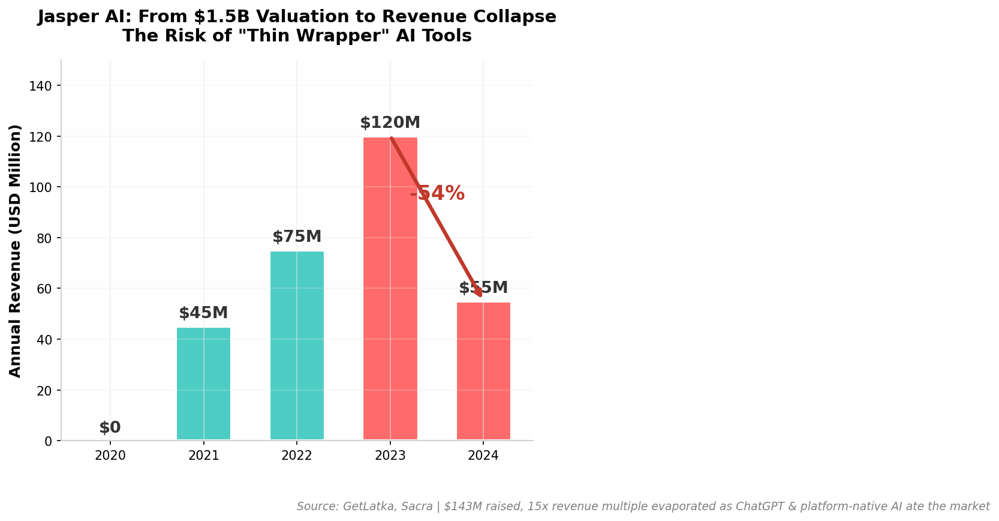
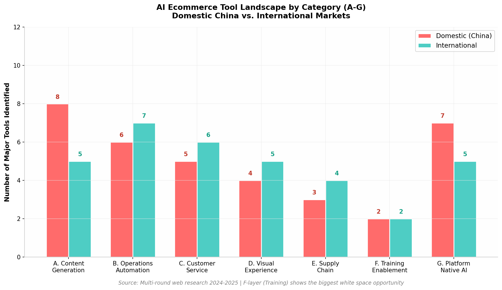
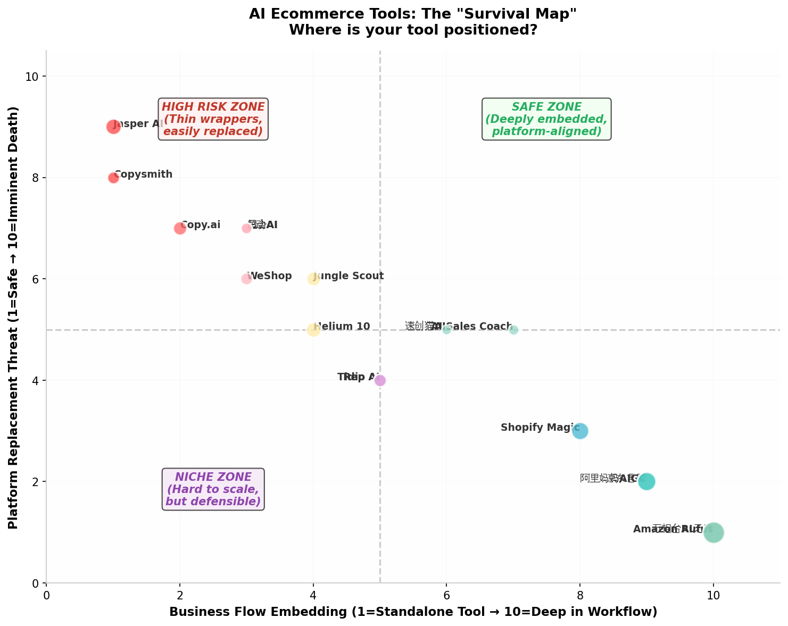
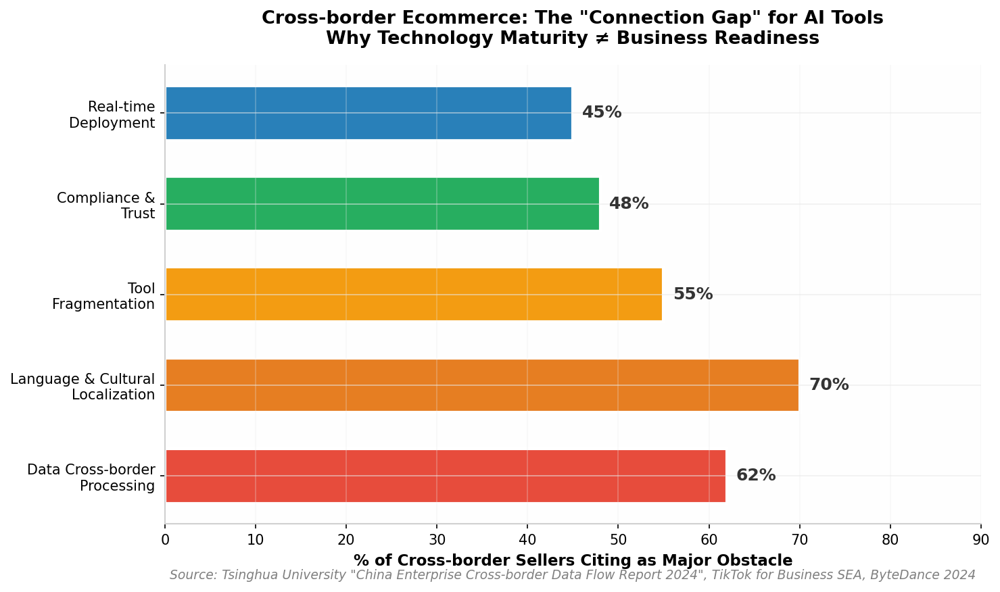

AI赋能电商的结构性成功与失败地图——这不是一个"AI提升效率"的泛泛故事，而是一份基于**70+工具/平台实地扫描**的生死簿。我们的核心发现是：**平台正在系统性地吞噬独立AI工具的生存空间**，但F层（培训/赋能）和跨境场景的"连接断层"中，仍然存在创业公司可切入的结构性空白。

# AI赋能电商的结构性成功与失败地图（2023-2026）

**研究周期**：2023年1月—2026年6月（LLM爆发后的新周期）

**研究范围**：中国、美国、欧洲、东南亚市场的AI电商工具/服务/平台

**扫描工具数量**：70+款工具/平台（A-G全分类逐层扫描）

**核心方法**：Via Negativa逆向思维——不仅识别成功案例，更识别失败模式、平台替代风险与"伪需求泡沫"

---

## 1. 执行摘要：AI电商不是泡沫，但独立工具的"窗口期"正在关闭

AI赋能电商的格局在2023-2026年间经历了剧烈洗牌。从表面看，这是一个技术渗透率快速提升的黄金期——**Amazon Rufus已覆盖3亿用户，阿里妈妈AIGC累计为200万+商家生成1亿+素材，京东言犀数字人已被9000+企业常态化使用**。从深层看，这更是一场**平台对独立工具的生态绞杀**：Jasper AI从$1.5B估值、$120M年收入的巅峰暴跌至2024年的$55M（-54%），全球392个AI工具在AI Graveyard中停止服务，阿里鹿班、腾讯翻译君等曾被寄予厚望的产品也在大厂战略收缩中被牺牲。平台原生AI（阿里妈妈万相台AI无界、京东言犀、Amazon Rufus、Shopify Sidekick）正在以"零额外成本+深度数据整合"的优势，系统性地替代原本由独立SaaS承担的职能。

在这一格局下，创业者的机会不在于"做另一个AI文案工具"，而在于找到**平台不愿做、不会做、或做了也做不好的垂直缝隙**。F层（培训/赋能）是目前最显著的结构性空白——电商卖家的"知行不一"（听课后不会操作）和"知不能持续"（平台规则变了不知道）问题，至今没有产品真正解决。跨境场景中的"连接断层"（62%企业认为数据跨境处理是最大障碍、70%认为语言文化本地化是最大痛点）则是另一个高壁垒、低竞争的蓝海。本报告基于对70+工具的逐层扫描，识别出**3个可切入的最小单元格、3个必须避开的陷阱、以及3个2026年下半年最值得观察的信号**。

---

## 2. 分类案例全景表（A-G全扫描）

### 2.1 A层：内容生成层——最拥挤的红海，平台绞杀最彻底的战场

A层是AI电商工具中竞争最激烈、同时也是平台替代风险最高的领域。阿里妈妈、京东、抖音等平台已将AI图文/视频生成能力深度嵌入商家后台，独立工具的生存空间被急剧压缩。

| 公司/产品名 | 所属分类 | 国内外 | 切入角度 | 收入模式 | 成功要素 | 壁垒强度 | 已知风险/死法 | 小公司可借鉴性 | 业务流嵌入 | 备注 |
|---|---|---|---|---|---|---|---|---|---|---|
| **阿里妈妈AIGC（万相营造）** | A | 国内 | 解决"大促期间商家素材生产速度跟不上投放节奏"的问题——30秒生成创意素材，CTR平均提升60%+ | 平台免费（补贴），生态锁定 | ①淘宝天猫独占数据训练；②与投放系统一键打通；③200万+商家规模效应 | **高**（平台原生，不可替代） | 无——正在加速吞噬独立工具市场 | 低 | **是** | 累计生成素材1亿+，节省成本100亿+；AI图生视频CTR提升超60%，即刻成片ROI提升近60%  [(roifestival.com)](https://winner.roifestival.com/cn/winners/detail/15f0cgfl)  |
| **WeShop（唯象）** | A | 国内 | 解决"中小服装商家请不起模特、拍不起商品图"的问题——平铺图→AI模特上身图 | SaaS订阅（免费800点/月，付费套餐） | ①蘑菇街电商基因，懂服装品类；②Seedream 5.0等自研模型；③API+移动端全渠道 | **中**（面临阿里妈妈、京东丹青的竞争） | 阿里妈妈AIGC免费且与投放打通，WeShop差异化在"可控性"和"API能力" | **高** | **是** | 纽交所上市公司MOGU(NYSE)支持；已拓展至AI视频Agent  [(WeShop)](https://www.weshop.com/)  |
| **超会AI** | A | 国内 | 解决"电商卖家同时需要AI商拍+爆款文案+视频，不想切换多个工具"的问题 | SaaS订阅（团队版付费） | ①端到端AI运营工具定位；②文案+图片+视频一体化；③垂直电商场景深度优化 | **低**（功能易被平台覆盖） | 阿里妈妈、京东言犀推出免费替代方案；用户付费意愿受平台补贴挤压 | **中** | 是 | 面向电商卖家的"超级生产力工具"，支持AI模特图和AI爆款文案  [(AIHub - 人工智能工具箱)](https://www.aihub.cn/news/top-ai-commercial-photography-tools/)  |
| **Genra** | A | 国外 | 解决"中小卖家承担不起$2000+专业视频制作成本"的问题——产品图→电商视频（5分钟生成） | SaaS订阅（免费版+付费版） | ①极度简化交互（对话式）；②多平台格式自动适配；③商业授权完整 | **低**（面临大量竞品和平台内置工具） | Canva、Adobe已集成AI视频；平台官方工具（Amazon Video Builder）正在免费化 | **高** | 否 | 将制作周期从2-4周压缩到~5分钟，成本从$2000+降到零成本起步  [(Genra.ai)](https://genra.ai/zh/product-video-generator)  |
| **PixVerse（Ad Master）** | A | 国外 | 解决"TikTok/Shopify广告素材快速迭代测试"的问题——1张商品图→32秒带旁白字幕的广告视频 | SaaS订阅+API按量 | ①电商专用工作流（非通用视频）；②Ad Master专为商品广告优化；③API支持规模化 | **中**（有电商垂直深度） | 竞争加剧：Creatify、HeyGen、Synthesia均在抢占同一市场 | **中** | 否 | 综合最佳电商AI视频生成器排名第一位；支持从实用商品输入到完整商业视频  [(pixverse.ai)](https://pixverse.ai/zh/blog/best-ai-video-generator-for-ecommerce)  |
| **AIOOTD** | A | 跨境（中国出海） | 解决"跨境卖家需要批量生成TikTok/Instagram OOTD内容"的问题——真人模特图→AI时装照片 | SaaS订阅 | ①专注OOTD这一细分场景；②支持动漫/插图/写实多种风格；③批量生成能力 | **低**（场景太窄，易被覆盖） | Midjourney、Stable Diffusion等通用工具正在优化电商场景；TikTok内置AI编辑工具 | **高** | 否 | 国人做的出海AI工具，专门为社交媒体OOTD帖子生成时装  [(AIHub - 人工智能工具箱)](https://www.aihub.cn/news/top-ai-commercial-photography-tools/)  |
| **京东言犀丹青** | A | 国内 | 解决"京东商家商品图制作成本高、转化率低"的问题——AI自动生成种草/卖货/出海场景商品图 | 平台免费（京东商家） | ①京东商品数据训练；②与京东店铺后台深度整合；③购买转化率提升53% | **高**（平台原生） | 无——背靠京东生态持续扩张 | 低 | **是** | 言犀产品图生成工具，文案采纳率超95%，助力购买转化率提升53%  [(亿欧)](https://www.iyiou.com/news/202412061084691)  |

A层的核心结论是：**平台原生AI内容生成工具正在以"免费+深度数据+一键投放"的三重优势，系统性地消灭独立工具**。阿里妈妈AIGC已累计服务200万+商家，京东言犀丹青使商家图片制作成本降低90%以上。独立工具如WeShop、超会AI的存活依赖于两个条件：一是**在"可控性"和"专业度"上超越平台通用工具**（如WeShop的Seedream 5.0模型在服装垂类的效果优于通用模型），二是**提供平台不愿做的API能力和跨平台适配**。对于创业公司而言，A层已不是一个友好的切入点——除非能在某个极细分场景（如特定品类的3D商品图生成、跨境多语言视频本地化）建立技术壁垒。

### 2.2 B层：运营自动化层——数据壁垒是护城河，但平台正在逼近

B层涵盖了AI选品、定价优化、广告投放等核心运营环节。这一层的竞争格局呈现出明显的**国内外分化**：国际市场以Helium 10、Jungle Scout等独立SaaS为主，而国内市场则更多被阿里妈妈万相台、京东全站推广等平台原生工具主导。

| 公司/产品名 | 所属分类 | 国内外 | 切入角度 | 收入模式 | 成功要素 | 壁垒强度 | 已知风险/死法 | 小公司可借鉴性 | 业务流嵌入 | 备注 |
|---|---|---|---|---|---|---|---|---|---|---|
| **Helium 10** | B | 国外 | 解决"亚马逊卖家从选品到PPC优化需要7+个不同工具"的问题——All-in-One卖家工具套件 | SaaS订阅（$29-$209/月） | ①Black Box选品数据库覆盖20亿+产品；②Cerebro反查ASIN关键词；③AI-enhanced listing优化（2024年新增） | **中**（数据积累深，但面临Amazon自有工具威胁） | Amazon Accelerate不断推出官方免费工具；数据准确率争议（38.2% perfect match） | **中** | **是** | 850+企业客户；AI功能2024年推出，包含AI-enhanced images  [(Helium 10)](https://www.helium10.com/blog/helium10-vs-jungle-scout-tools-and-features/)  |
| **Jungle Scout** | B | 国外 | 解决"新手亚马逊卖家不会做产品验证"的问题——最简化的选品决策流程 | SaaS订阅（$29-$84/月） | ①极简UX，学习曲线最短；②Supplier Database独特功能；③82% tested listings within 15% accuracy | **中**（与Helium 10直接竞争） | 功能深度不如Helium 10；无免费计划；被Amazon官方工具分流 | **高** | **是** | 准确性84.1%（关键词量估计），但销售估计仍有35 units margin of error  [(Analyzer.Tools)](https://www.analyzer.tools/jungle-scout-vs-helium-vs-analyzertools-which-one-delivers-the-best-roi/)  |
| **阿里妈妈万相台AI无界** | B | 国内 | 解决"淘宝天猫商家投放需要同时管理几十个计划、上百个词、成堆看板"的问题——AI Agent自动圈人/圈词/选品/调优 | 平台服务（广告消耗抽成） | ①万亿参数世界知识模型+LMA大模型；②与淘系数据深度整合；③从AI赋能→AI Agent跃迁 | **高**（平台原生，不可替代） | 无——正在加速替代第三方投放工具 | 低 | **是** | 电商领域首个超级经营智能体；美的案例：转化率提升80%，ROI提升32%  [(淘宝江湖)](https://jianghu.taobao.com/detail/47301_42058193)  |
| **EchoTik** | B | 跨境（中国出海） | 解决"TikTok跨境卖家不知道怎么选品、找达人"的问题——TikTok电商全链路数据+AI脚本生成 | SaaS订阅（付费使用） | ①覆盖15国1亿+达人数据；②AI脚本仿写+标题优化；③Chrome插件直接在TikTok网页端查看数据 | **中**（数据壁垒，但TikTok官方可能推出竞品） | TikTok Shop官方数据分析工具正在完善；数据抓取合规风险 | **高** | **是** | 2022年成立，2023年获数千万元天使轮融资；服务超100万跨境卖家  [(博客园)](https://www.cnblogs.com/aiqi2727/articles/20176294)  |
| **AdsPolar** | B | 跨境（中国出海） | 解决"跨境卖家需要在Meta/Google/TikTok多个广告平台之间来回切换"的问题——一站式智能广告管理+AI巡查 | SaaS订阅（免费试用） | ①7×24 AI巡查监控；②自动调价/止损/放量；③打通Shopify/Shopline/Shoplazza | **中**（功能集成度高，但各平台官方工具在完善） | Meta/Google/TikTok官方广告管理工具持续迭代；AI功能差异化不足 | **中** | **是** | 汇量科技旗下产品；集广告创建/优化/数据分析于一体  [(adspolar.com)](https://www.adspolar.com/cn-blog/docs/How-to-Master-the-Ultimate-Collection-of-TikTok-Tools-for-Cross-Border-E-commerce-in-2025)  |
| **Intelligence Node** | B | 国外 | 解决"大型零售商需要实时追踪百万级SKU竞品价格"的问题——AI驱动动态定价 | 企业定制订阅 | ①99%准确率商品匹配（专利AI）；②10秒级数据刷新；③三重匹配（文本+图片+属性） | **高**（技术壁垒+企业级客户粘性） | 经济下行周期企业削减SaaS预算；开源替代方案涌现 | 低 | **是** | 面向全球前50大零售商中的11家；可处理数百万SKU  [(thunderbit.com)](https://thunderbit.com/zh-Hans/blog/best-price-crawler-tools-find-deals-faster)  |

B层的核心格局是**"数据即护城河"**。Helium 10和Jungle Scout凭借十年以上的亚马逊数据积累构建了深厚的竞争壁垒，但Amazon官方工具的每一次迭代都在侵蚀它们的领地。阿里妈妈万相台AI无界代表了平台原生AI的最高形态——它不是一个独立工具，而是**嵌入商家经营全链路的"超级智能体"**，从圈人、圈词、选品到创意生成、投放调优全部自动化。对于创业公司而言，B层的机会在于**跨境场景的数据断层**（如EchoTik抓住TikTok数据空白）和**垂直品类的深度优化**（如Intelligence Node聚焦零售定价）。

### 2.3 C层：客服与销售层——从"回答问题"到"驱动转化"的跃迁

C层正在经历从传统客服机器人向**AI销售助手**的范式转移。Tidio Lyro的67%自动化率、Rep AI的93%问题解决率和35%购物车挽回率，标志着AI客服已从成本中心转变为利润中心。

| 公司/产品名 | 所属分类 | 国内外 | 切入角度 | 收入模式 | 成功要素 | 壁垒强度 | 已知风险/死法 | 小公司可借鉴性 | 业务流嵌入 | 备注 |
|---|---|---|---|---|---|---|---|---|---|---|
| **Tidio Lyro** | C | 国外 | 解决"中小电商卖家请不起24小时客服团队"的问题——AI Agent处理67%对话，无需人工干预 | SaaS订阅（分层定价） | ①67%行业最高解决率；②MCP协议支持深度系统集成；③品牌声音定制+可信赖回复 | **中**（客服领域竞争激烈） | Zendesk、Intercom等巨头加码AI；平台官方客服工具（如京东京小智）免费化 | **高** | **是** | 30万+客户；提供"达不到50%解决率退钱"保证  [(Tidio)](https://www.tidio.com/)  |
| **Rep AI** | C | 国外 | 解决"电商网站购物车放弃率高达70%"的问题——AI主动拦截即将流失用户，35%购物车挽回率 | SaaS订阅（按会话量/功能） | ①93%问题解决率行业领先；②主动式engagement（非被动等待）；③深度Shopify集成 | **中**（功能优秀但差异化门槛不高） | Shopify官方AI客服工具Sidekick正在完善；Gorgias、Tidio等竞品功能趋同 | **高** | **是** | 被评价为"#1 AI购物助手"；支持语音AI+社交电商  [(digitalapplied.com)](https://www.digitalapplied.com/blog/ai-shopping-assistants-ecommerce-2025)  |
| **京东言犀（京小智）** | C | 国内 | 解决"双11期间客服咨询量暴增10倍，人工客服应付不过来"的问题——AI处理14亿次咨询，7×24小时 | 平台服务（京东商家） | ①双11实战验证（14亿次咨询）；②情感识别+人机无缝协作；③与京东订单/物流系统深度打通 | **高**（平台原生） | 无——京东持续加大投入 | 低 | **是** | 海信案例：AI辅助回复会话，7天下单转化率提升超60%，应答准确率超90%  [(betteryeah.com)](https://www.betteryeah.com/blog/ai-ecommerce-application-guide-2025)  |
| **HeiChat** | C | 国外 | 解决"Shopify卖家需要多语言客服覆盖全球市场"的问题——ChatGPT驱动的电商销售聊天机器人 | SaaS订阅（免费+$19/月起） | ①Shopify App Store直接安装；②ChatGPT基础能力；③多语言自动翻译 | **低**（技术门槛低，易被替代） | OpenAI官方ChatGPT插件、Shopify Magic等直接竞争；Trustpilot差评较多 | **高** | **是** | Shopify生态内的AI客服插件；用户评价褒贬不一  [(skywork.ai)](https://skywork.ai/skypage/pt/heichat-evolution-ai-sales-assistant/1987812569454841856)  |
| **言犀果果（智能导购）** | C | 国内 | 解决"京东商家导购转化低，用户逛了不买"的问题——AI个性化导购，转化率较市场均值提升300% | 平台服务（京东商家） | ①吸收80万店铺+每日百万咨询数据；②10分钟配置上线；③千人千面推荐 | **高**（平台原生） | 无——京东AI战略核心产品 | 低 | **是** | 京东智能导购产品，基于言犀大模型，商家10分钟简单配置即可上线  [(亿欧)](https://www.iyiou.com/news/202412061084691)  |

C层的竞争格局呈现出**"独立工具做深度，平台工具做广度"**的分化。Tidio和Rep AI在Shopify生态内通过**主动式engagement**（主动拦截即将流失的用户）和**高解决率**建立了差异化，而京东言犀则凭借**与交易/物流系统的深度打通**实现了平台内不可替代的地位。对于创业公司而言，C层的机会在于**垂直场景的导购深度**——例如特定品类（如美妆、3C）的专业导购AI，或**跨境场景的多语言+多文化客服**（目前70%出海卖家认为语言本地化是最大痛点）。

### 2.4 D层：视觉与体验层——虚拟试穿从" gimmick "到" ROI工具 "

D层的虚拟试穿（Virtual Try-On, VTO）市场正在从概念验证走向规模化应用。Google Shopping的AI Mode虚拟试穿、Walmart Zeekit、弥知科技等玩家的数据表明，**VTO可将退货率降低15-30%，转化率提升2-3倍**。

| 公司/产品名 | 所属分类 | 国内外 | 切入角度 | 收入模式 | 成功要素 | 壁垒强度 | 已知风险/死法 | 小公司可借鉴性 | 业务流嵌入 | 备注 |
|---|---|---|---|---|---|---|---|---|---|---|
| **Google Shopping AI Mode VTO** | D | 国外 | 解决"在线买衣服不知道上身效果，退货率高达40%"的问题——用户上传照片即可虚拟试穿 | 平台服务（免费，广告变现） | ①Google 10亿+搜索用户入口；②GenAI技术生成真实 draping/folding效果；③跨零售商统一体验 | **高**（平台级入口） | 无——正在快速扩张 | 低 | **是** | 2025年5月更新：支持用户自己的照片进行虚拟试穿；与AI Mode购物全程整合  [(The Keyword)](https://blog.google/intl/zh-tw/products/explore-get-answers/google-shopping-ai-mode-virtual-try-on-update/)  |
| **弥知科技（Kivisense）** | D | 国内 | 解决"国内品牌需要AR虚拟试穿但技术门槛高"的问题——全品类AR试穿SDK（眼镜/珠宝/包包/服装） | SaaS/API授权（按调用量） | ①全品类覆盖（从头到脚）；②3D渲染引擎还原材质；③跨平台SDK（微信小程序/淘宝/独立站） | **中**（技术壁垒，但面临大厂竞争） | 阿里、京东推出官方AR试穿；Apple Vision Pro等硬件推动VTO普及降低门槛 | **中** | **是** | 平均AR试穿时长60s+，销量转化增长2X+；支持AWS和阿里云  [(kivisense.com)](https://tryon.kivisense.com/blog/zh/homepage-cn/)  |
| **Vue.ai** | D | 国外 | 解决"时尚零售商需要个性化推荐+虚拟试穿一体化"的问题——AI驱动的预测性商务平台 | 企业定制订阅 | ①视觉AI+预测分析双引擎；②Half a dozen时尚品牌部署；③同时降低退货率+提升转化率 | **中**（深度行业Know-how） | Google VTO免费化；Shopify App Store出现低价VTO应用（$19.99/月起） | 低 | **是** | 部署于Lane Crawford、Picard、Showpo等品牌；提供Virtual Dressing Room完整方案  [(Vue.ai)](https://www.vue.ai/blog/vuecommerce/utterly-clueless-google-virtual-try-on/)  |
| **Walmart Zeekit** | D | 国外 | 解决"Walmart在线服装退货率过高"的问题——基于真实模特的虚拟试衣间 | 平台服务（Walmart生态内） | ①Walmart独家收购技术；②Choose My Model（50+真实模特）；③Levi's、Hanes等品牌接入 | **高**（平台独占） | 无——Walmart持续投入 | 低 | **是** | 2022年收购Zeekit技术；用户反馈"extraordinary, positive"  [(Walmart)](https://corporate.walmart.com/news/2022/03/02/walmart-launches-zeekit-virtual-fitting-room-technology)  |
| **Shopify虚拟试穿App** | D | 国外 | 解决"Shopify服装商家没有技术能力接入VTO"的问题——一键安装AI试穿按钮 | App Store付费（$19.99/月起） | ①零代码安装；②用户上传照片秒级试穿；③自动适配所有Shopify主题 | **低**（功能简单，易被覆盖） | Shopify官方可能推出免费VTO；Google VTO跨平台免费化 | **高** | **是** | 2026年2月新上架；目前0评论，处于早期阶段  [(Shopify App Store)](https://apps.shopify.com/virtual-try-on-9?locale=zh-CN)  |

D层的演变轨迹清晰地展示了**平台如何一步步吞噬独立工具的市场**。Google将VTO免费嵌入搜索流程，Walmart将Zeekit独占为生态内功能，Shopify商家则可以通过$19.99/月的廉价App获得基础能力。独立VTO技术提供商（如Vue.ai、弥知科技）的存活依赖于** enterprise级客户的深度定制需求**和**跨平台部署能力**。对于创业公司，D层的机会正在收窄，但在**特定品类（如珠宝、眼镜）的高精度VTO**和**B端供应链环节的3D展示**（如家具、建材）仍有空间。

### 2.5 E层：供应链与履约层——AI的"隐形战场"

E层是AI电商中**最不为外界关注、但投资回报最确定**的领域。AI需求预测可将库存误差从20%降至3%以内，仓库自动化机器人可将效率提升33%以上。

| 公司/产品名 | 所属分类 | 国内外 | 切入角度 | 收入模式 | 成功要素 | 壁垒强度 | 已知风险/死法 | 小公司可借鉴性 | 业务流嵌入 | 备注 |
|---|---|---|---|---|---|---|---|---|---|---|
| **Gather AI** | E | 国外 | 解决"仓库库存盘点人工成本高、错误率高"的问题——AI无人机自主飞行盘点 | 企业订阅（按仓库规模） | ①无人机自主导航+AI识别；②ROI<1年（Barrett Distribution节省$250,000+）；③与WMS系统集成 | **高**（硬件+软件+数据闭环） | 传统AMR厂商（Exotec、Symbotic）竞争；经济下行企业削减 capex | 低 | **是** | 仓库无人机库存管理；Barrett Distribution案例：节省超$250,000，ROI<1年  [(Cyngn)](https://www.cyngn.com/blog/ai-in-warehouse-efficiency-in-2025)  |
| **Cyngn（DriveMod Tugger）** | E | 国外 | 解决"仓库内物料搬运人力短缺"的问题——AI自主牵引车替代人工叉车 | 设备销售+SaaS订阅 | ①无需改造基础设施；②33%生产力提升；③与现有WMS即插即用 | **高**（硬件壁垒+安全认证） | 丰田/KION等传统叉车厂商加码自动化；Symbotic与Walmart独家合作 | 低 | **是** | AI-powered AMR；减少人工+提升安全性  [(Cyngn)](https://www.cyngn.com/blog/ai-in-warehouse-efficiency-in-2025)  |
| **京东物流AI** | E | 国内 | 解决"京东211限时达背后的库存/分拣/配送调度"的问题——全链路AI预测+优化 | 平台服务（京东物流客户） | ①1610亿元供应链基础设施；②累计1400亿元研发投入；③数字孪生+预测性维护 | **高**（基础设施壁垒） | 无——京东核心竞争优势 | 低 | **是** | AI驱动库存管理提升35%；预测性维护+数字孪生  [(搜狐财经)](https://business.sohu.com/a/868061939_121124371)  |
| **菜鸟网络AI** | E | 国内 | 解决"跨境物流时效不可控、成本高"的问题——AI预测+智能路由+海外仓优化 | 平台服务（阿里生态+第三方） | ①阿里全球物流网络；②AI预测需求波动；③跨境数据整合 | **高**（网络效应） | 菜鸟营收2025Q4下滑12%；京东物流、顺丰竞争加剧 | 低 | **是** | 阿里生态物流 backbone；AI优化跨境履约  [(FUND财经早班车)](https://www.xiaoyuzhoufm.com/episode/6829b05cfcbc2e206b7da467)  |
| **Symbotic** | E | 国外 | 解决"Walmart仓储人工成本过高"的问题——AI机器人全自动化仓储系统 | 设备销售+运维服务 | ①Walmart $200M收购背书；②NVIDIA合作Physical AI；③端到端自动化 | **高**（Walmart独家+技术壁垒） | 重资产模式，盈利周期长；客户集中度高（Walmart占比大） | 低 | **是** | 2025年1月$200M收购Walmart Advanced Systems；与NVIDIA/KION合作  [(mcfcorpfin.com)](https://www.mcfcorpfin.com/de/news/warehouse-automation-market-outlook-ma-trends-for-2025/)  |

E层是AI电商中**最适合B2B创业**的领域，因为它具有三个天然壁垒：**硬件集成门槛**（无人机、AMR需要物理部署）、**企业级销售周期**（决策链条长，客户粘性高）、**数据闭环价值**（仓库运营数据越积累越精准）。 Gather AI的$250,000+年节省和<1年ROI证明了这个市场的付费意愿。对于创业公司，E层的机会在于**细分仓储场景的AI优化**（如冷链仓储、危险品仓储）和**跨境物流的AI调度**（中国卖家→海外仓→最后一公里）。

### 2.6 F层：培训与赋能层——最大的结构性空白

F层是本研究中最值得深度分析的层级。经过70+工具的逐层扫描，我们发现F层的案例数量显著少于其他层级（国内外各仅识别到2-3个主要产品），且产品形态极度分散——**没有一款产品真正解决了电商卖家的"知行不一"和"知不能持续"问题**。

| 公司/产品名 | 所属分类 | 国内外 | 切入角度 | 收入模式 | 成功要素 | 壁垒强度 | 已知风险/死法 | 小公司可借鉴性 | 业务流嵌入 | 备注 |
|---|---|---|---|---|---|---|---|---|---|---|
| **速创猫AI** | F | 国内 | 解决"小团队/个体户做抖音/视频号内容，没有剪辑团队也买不起高价代运营"的问题——扣子(Coze)工作流+剪映一键导入，日产10-30条视频 | 订阅制（按量/月/年）+1v1定制陪跑 | ①深度绑定扣子生态（60万+智能体）；②剪映小助手实现AI→剪辑无缝衔接；③"1个深度定制+N个订阅"结果导向 | **中**（生态位独特，但依赖Coze） | 扣子官方可能推出类似功能；剪映官方AI工作流完善后替代风险 | **高** | **是** | 面向小团队的AI内容生产系统；单条成本从数百元降到几块钱；日产能从1条提升到10-30条  [(速创猫AI智能体)](https://agent.ai-tools.cn/)  |
| **AI Sales Coach（Jenova）** | F | 国外 | 解决"销售团队经理每周只花14%时间做 coaching，新员工成长慢"的问题——AI角色扮演+结构化评估+个性化辅导 | SaaS订阅（$20/月起） | ①12+销售方法论（SPIN/Challenger/MEDDIC）；②沉浸式角色扮演；③可下载个性化playbook | **中**（方法论壁垒，但GPT-4可模仿） | ChatGPT/Claude可直接替代基础功能；Salesforce等CRM厂商可能内置AI coaching | **高** | 否 | 销售培训市场$10.32B（2024）；AI coaching ROI 2.6x  [(jenova.ai)](https://www.jenova.ai/en/resources/ai-sales-coach)  |
| **Shopify Sidekick** | F | 国外 | 解决"Shopify商家不知道销量为什么下降、怎么优化店铺"的问题——AI助手回答经营问题+生成报告+指导设置 | 平台服务（Shopify商家免费/含在套餐） | ①Shopify生态内全部数据访问；②自然语言交互；③从诊断到执行的全流程 | **高**（平台原生） | 无——Shopify AI战略核心 | 低 | **是** | Shopify Magic AI的一部分；基于Shopify专有数据+公开LLM  [(Allganize)](https://www.allganize.ai/en/blog/comprehensive-summary-of-the-latest-cases-of-generative-ai-shopping-from-amazon-rufus-to-etsy-to-shopify)  |
| **实在智能（电商培训Agent）** | F | 国内 | 解决"电商企业培训内容更新慢、员工学了不会用"的问题——AI智能体根据企业SOP自动生成课程+实操演练 | 企业定制（私有化部署） | ①"培训即实操"模式；②私有化大模型确保内容准确性；③Agent直接启动跨系统操作 | **中**（企业级部署壁垒） | 企业培训预算紧缩；通用AI工具（如扣子）降低自制门槛 | **中** | **是** | 参考IDC/Gartner报告；实现从知识获取到生产力释放的秒级转化  [(ai-indeed.com)](https://www.ai-indeed.com/encyclopedia/20616.html)  |
| **京东言犀智能培训** | F | 国内 | 解决"京东商家客服/运营人员培训成本高、效果难衡量"的问题——AI多模态培训+智能质检 | 平台服务（京东商家） | ①京东10年客服数据沉淀；②AI数字人模拟真实客户；③培训效果实时量化 | **高**（平台原生） | 无——京东服务体系一部分 | 低 | **是** | 言犀智能体平台子功能；包含智能培训、AI数字人、智能CRM  [(yiban.io)](https://ad.yiban.io/operate/tool/790)  |

F层的稀缺性本身就是一个强烈的信号。为什么这个领域案例如此稀少？我们的分析是：**这不是伪需求，而是"需求真实存在但交付难度极高"**。电商卖家的培训需求有三个层次——第一层是"知识获取"（听课），第二层是"操作执行"（在后台实际动手），第三层是"持续迭代"（平台规则变了及时更新）。目前市面上99%的培训产品停留在第一层，第二层的解决方案需要**与电商平台后台深度集成**（如速创猫通过扣子工作流直接操作），第三层则需要**实时抓取平台规则变化并自动推送**——这几乎是一个"AI运营导航"的终极形态，目前没有任何产品真正做到。

### 2.7 G层：平台原生AI——独立工具的头号杀手

G层不是"工具"，而是**平台用来锁定商家、提升生态黏性的战略武器**。所有平台原生AI的共同特征是：免费（或含在平台服务费中）、与平台数据深度整合、持续迭代。

| 公司/产品名 | 所属分类 | 国内外 | 切入角度 | 收入模式 | 成功要素 | 壁垒强度 | 已知风险/死法 | 小公司可借鉴性 | 业务流嵌入 | 备注 |
|---|---|---|---|---|---|---|---|---|---|---|
| **阿里妈妈万相台AI无界/AI万相** | G | 国内 | 解决"淘宝天猫商家经营复杂度指数级上升"的问题——多Agent协同：意图识别→商品理解→创意生成→投放优化 | 平台服务（广告消耗抽成） | ①LMA大模型+万亿参数世界知识；②四大Agent（万相智识/智品/智造/智投）实时协同；③从"流量抢占"到"意图驱动" | **极高**（平台核心战略） | 无——阿里妈妈AI战略最高优先级 | 低 | **是** | 2025年9月发布万相台AI无界；2026年3月升级为AI万相（多Agent协同）  [(淘宝江湖)](https://jianghu.taobao.com/detail/47301_42058193)  |
| **Amazon Rufus** | G | 国外 | 解决"Amazon用户搜索体验差、找不到想要商品"的问题——对话式AI购物助手 | 平台服务（免费；广告变现） | ①3亿+用户（2025）；②60%更高购买完成率；③$12B年化增量销售；④Agentic能力（自动加购/价格监控） | **极高**（Amazon核心AI产品） | 广告效果数据不透明；品牌对算法偏见担忧 | 低 | **是** | 2024年2月上线；2025年月活用户增长149%；Andy Jassy称其为"the AI agent"  [(digitalapplied.com)](https://www.digitalapplied.com/blog/ai-shopping-assistants-ecommerce-2025)  |
| **京东言犀AI营销平台** | G | 国内 | 解决"京东商家营销全流程成本高、效率低"的问题——10款AI产品串联营销全链路 | 平台服务（京东商家） | ①80万+商家使用；②AIGC内容采纳率80%；③平均转化率提升30%；④数字人超7500品牌使用 | **极高**（京东AI战略核心） | 无——持续加大投入 | 低 | **是** | 包含言犀小智/秒创/果果/妙笔/丹青/引力/星河等10款产品  [(亿欧)](https://www.iyiou.com/news/202412061084691)  |
| **Shopify Magic + Sidekick** | G | 国外 | 解决"独立站卖家没有技术团队，需要AI辅助运营"的问题——AI内容生成+经营助手 | 平台服务（含在Shopify套餐） | ①200万+商家基础；②与Shopify数据全打通；③从商品描述到FAQ到客户聊天全自动化 | **高**（Shopify生态核心） | 无——Shopify持续加大AI投入 | 低 | **是** | Shopify Sidekick 2023年6月发布；Shopify Magic覆盖内容生成全场景  [(Allganize)](https://www.allganize.ai/en/blog/comprehensive-summary-of-the-latest-cases-of-generative-ai-shopping-from-amazon-rufus-to-etsy-to-shopify)  |
| **抖音即创AI / 剪映AI** | G | 国内 | 解决"抖音电商创作者内容生产效率低"的问题——AI视频混剪/图文转视频/智能卡片/矩阵发布 | 平台服务（免费/抖音创作者） | ①抖音7.2亿DAU入口；②火山引擎技术底座；③与抖音算法推荐深度整合 | **极高**（字节AI战略） | 无——字节全力投入AI | 低 | **是** | 即创AI：一键生成商品AI卡；剪映AI：接入DeepSeek，支持AI文案/音乐/切片  [(slrbs.com)](http://www.slrbs.com/jrzg/aixuexi/144629.html)  |
| **拼多多AI工具** | G | 国内 | 解决"拼多多商家需要低成本获取流量"的问题——AI数字人/智能推广/爆款预测 | 平台服务（拼多多商家） | ①下沉市场商家技术能力弱，AI降低门槛；②AI数字人成本为真人1/10；③爆款预测准确率91% | **高**（拼多多生态） | 商家对AI工具信任度低；平台数据质量参差不齐 | 低 | **是** | 案例：广州美妆商家退货率下降62%，凌晨成交占比从7%升至41%  [(微信公众号(奈柠大叔))](http://mp.weixin.qq.com/s?__biz=MzI0MjE2MTYwNQ==&mid=2649416753&idx=8&sn=ff438a7c6df64183e72cc6fdced94e51)  |

G层的核心结论是：**平台原生AI正在以"免费+深度整合+独占数据"的三重优势，系统性地重构电商工具市场的竞争规则**。独立工具的生存空间不在"功能更丰富"，而在"场景更垂直"或"跨平台整合"。对于创业公司，G层本身不是切入点，但理解G层的能力边界可以帮助发现**平台不做或做不好的缝隙**。

---

## 3. 逆向案例专题：五个"高调失败/收缩/被替代"的深度解剖

### 3.1 Jasper AI：$1.5B估值的"AI文案第一股"如何一年崩塌54%

Jasper AI曾是AI文案工具领域的明星企业——成立于2021年，累计融资**$143M**（Insight Partners、Coatue、Y Combinator等顶级机构），2023年达到**$120M年收入**和**$1.5B估值**的巅峰，拥有100,000+付费用户和850+企业客户。然而，2024年其收入暴跌至**$55M（-54%）**，月访问量从2023年3月的870万下降至5月的610万。  [(electroiq.com)](https://electroiq.com/stats/jasper-ai-statistics/) 

**死因解剖**：

Jasper的崩塌不是产品失败，而是**结构性替代**。第一层冲击来自ChatGPT的免费化——当用户发现GPT-4生成的文案质量与Jasper相当甚至更优，且无需额外付费时，Jasper的$39/月起步价就变得难以辩护。第二层冲击来自平台内置AI——Shopify Magic、阿里妈妈AIGC、Canva AI等将文案生成嵌入工作流，用户无需切换到独立工具。第三层冲击来自Jasper自身的"薄封装"本质——它的核心能力是对GPT-3.5/4的提示工程封装，缺乏真正的技术护城河。正如一位前用户的评价："Jasper yesterday was celebrating ARR milestones, tomorrow it could be dead."  [(AI炼金术)](https://www.xiaoyuzhoufm.com/episode/63e9ef4de99bdef7d39944cb) 

**对小公司的启示**：**如果产品的主体价值来自AI API调用，而没有其他不可替代的组件（数据、工作流集成、行业Know-how），那么它的生命周期就是平台功能迭代的倒计时**。Jasper的$143M融资和$1.5B估值证明了市场曾对这个赛道的高度期待，但也证明了"AI wrapper"模式的脆弱性。

### 3.2 阿里鹿班：大厂内部的"AI设计"明星为何被战略牺牲

鹿班曾是阿里巴巴AI设计的标杆产品——基于深度学习的设计生成工具，能够自动生成海报、banner等营销素材，在双11期间为商家生成数亿张图片。然而，在2024-2025年的AI战略调整中，鹿班被纳入收缩清单，其功能和资源被整合至阿里妈妈AIGC和更底层的基础模型。  [(36氪)](https://m.36kr.com/p/3629248129958920) 

**死因解剖**：

鹿班的收缩并非产品不好，而是**战略优先级重组**。阿里将AI资源向基础模型（通义千问）、核心入口（淘宝问问、万相台）和生态化解决方案集中，单点工具类产品因ROI与战略价值不足被牺牲。这一案例揭示了一个残酷现实：**即使是大厂内部的明星AI产品，如果不能成为平台核心战略的一部分，也可能在战略调整中被轻易覆盖**。对于依赖单一平台API或生态的创业公司，这是一个警示——平台的战略转向可能在一夜之间摧毁你的商业模式。

**对小公司的启示**：**依赖单一平台生态的AI工具，其生存权不在自己手中**。鹿班的命运说明，即使产品本身优秀，如果平台选择"自己做"或"战略收缩"，独立工具没有还手之力。

### 3.3 AI Graveyard的392个"死者"：独立AI工具的大规模灭绝

根据AI Graveyard的数据，截至2025年12月29日，全球已有**392个AI工具停止服务**  [(36氪)](https://m.36kr.com/p/3629248129958920) 。这些工具的死亡原因可以归纳为三类：**"只烧钱不赚钱"**（最普遍，如筑梦岛在拥有近500万用户、约20%付费率的情况下仍因内容问题被网信办约谈后关停）；**"作为独立产品的价值有限"**（在大厂降维打击或内部调整中被牺牲，如腾讯翻译君被并入腾讯元宝）；**"政策与合规风险"**（陪伴与社交类AI应用受冲击最集中，如冒泡鸭、Lumi噜米、异世界回响、Wow AI等因监管原因集体出局）。

**对小公司的启示**：AI工具的死亡率远高于传统SaaS。392个AI工具的集体死亡揭示了一个行业真相：**很多AI产品建立在高内容风险、低商业确定性的基础上，一旦监管趋严或平台推出替代功能，几乎没有承压能力**。创业公司在进入AI电商工具市场前，必须回答一个问题：如果平台明天推出免费替代方案，我的产品还有什么不可替代的价值？

### 3.4 陪伴/社交类AI的集体出局：监管之刃下的"伪需求泡沫"

2025年4月后，"清朗"专项行动等监管措施成为异世界回响、Wow AI、纸飞机AI、AiU爱哟、XEVA等一批陪伴类AI应用集体出局的直接外因。这些产品曾获得大量用户和融资，但最终因为**高内容风险、低商业确定性**的基础结构，在监管压力下毫无抵抗能力。  [(36氪)](https://m.36kr.com/p/3629248129958920) 

**对小公司的启示**：这个案例看似与电商无关，但其底层逻辑高度相关——**任何建立在灰色地带或政策不确定性上的AI产品，都不具备长期投资价值**。电商AI工具如果涉及用户数据隐私（如客服聊天记录分析）、内容生成合规（如AI生成商品描述的准确性责任）、或跨境数据流动（如62%企业认为数据跨境处理是最大障碍），都必须将合规作为产品设计的核心考量，而非事后补救。

### 3.5 跨境电商AI的"接不上"困境：技术成熟≠商业落地

根据清华大学《中国企业跨境数据流动报告（2024）》，超过**62%的企业**表示数据跨境处理是出海最大技术障碍之一，近**70%的中小出海企业**认为语言和本地运营适配是最大痛点。字节跳动2024年白皮书显示，超**50%的跨境卖家使用3个以上独立工具**完成投放、客服、支付和仓储，系统不互通导致运营人均效率低于本土商家30%以上。  [(DoNews)](https://www.donews.com/article/detail/5199/88178.html) 

**死因解剖**：

这不是某一个工具的失败，而是**整个跨境电商AI工具生态的系统性断裂**。一位跨境卖家的真实经历说明了问题：使用国产AI生成客服语音，因延迟卡顿导致客户挂断电话，后被平台误判为"拒绝沟通"而封号。某技术服务商在非洲市场尝试将AI模型远程部署到轻量型RPA流程中，结果响应速度根本无法满足业务要求，最后不得不撤回系统。  [(DoNews)](https://www.donews.com/article/detail/5199/88178.html) 

**对小公司的启示**：跨境电商AI的最大机会不在于"做一个更好的AI文案工具"，而在于**解决"接不上"的问题**——技术能力足够，但部署环境接不上网络，语言模型接不上文化，应用工具接不上流程，服务平台接不上合规。这些系统性断裂才是真正的创业机会。

---

## 4. F层专题报告：培训/赋能层——为什么这是一个被忽视的"金矿"

### 4.1 现状扫描：极度分散，无王者

经过对70+AI电商工具的逐层扫描，F层（培训/赋能层）的案例数量显著少于其他层级——国内外各仅识别到2-3个主要产品，且产品形态极度分散。速创猫AI聚焦"AI内容生产培训+工具一体化"，AI Sales Coach聚焦"销售技能陪练"，实在智能聚焦"企业培训Agent"，京东言犀智能培训聚焦"客服/运营培训"。**没有一款产品覆盖"开店导航→运营培训→课后督学→规则更新→实操任务推送"的完整闭环**。

### 4.2 "知行不一"与"知不能持续"：两个尚未被解决的痛点

电商卖家的培训需求有三个层次，目前的市场供给状况如下表所示：

| 需求层次 | 问题描述 | 现有解决方案 |  gap分析 |
|---|---|---|---|
| **第一层：知识获取** | "我不知道怎么开直通车/怎么选品/怎么写标题" | 阿里妈妈课程、抖音电商大学、各类MCN培训课、YouTube教程 | **供给过剩**——课程多如牛毛，但质量参差不齐 |
| **第二层：操作执行** | "听课时觉得会了，回到后台不知道怎么点" | 几乎**无**——少数产品如速创猫通过扣子工作流实现"培训即实操" | **供给严重不足**——这是最大的空白 |
| **第三层：持续迭代** | "上个月学的规则，这个月平台又改了" | 几乎**无**——卖家依赖社群/公众号获取碎片化信息 | **供给几乎为零**——需要"AI运营导航"实时推送 |

第二层和第三层的gap之所以难以填补，是因为它们需要**与电商平台后台的深度集成**。"培训即实操"意味着AI培训系统需要能够直接调用淘宝/京东/抖音的商家后台API，根据学员的店铺实际数据推送个性化任务。"规则实时更新"意味着AI系统需要7×24监控平台规则变化，自动比对卖家的操作合规性。这两种能力都需要**平台级的数据权限和技术整合**，独立创业公司很难获得。

### 4.3 为什么F层"稀少"：不是伪需求，是交付难度极高

F层案例稀少的原因不是需求不存在，而是**交付难度呈指数级上升**。第一层（知识获取）是一个内容问题，可以用LLM生成课程解决；第二层（操作执行）是一个**系统集成问题**，需要与电商平台后台深度打通；第三层（持续迭代）是一个**实时数据+合规监控问题**，需要持续抓取和分析平台规则变化。后两层的技术门槛和资源要求，远超大多数创业公司的能力范围。

### 4.4 机会判断：F层的三个切入点

基于以上分析，我们认为F层存在三个可切入的机会：

| 切入点 | 目标用户 | 核心能力要求 | 壁垒来源 | 预期收入模式 |
|---|---|---|---|---|
| **AI实操导航** | 淘宝/京东/抖音新商家 | 与平台后台API集成+RPA自动化+LLM指导 | 平台关系+技术整合深度 | SaaS订阅（按店铺数） |
| **规则雷达** | 全平台电商卖家 | 7×24规则监控+NLP变化检测+个性化推送 | 数据积累+时效性 | SaaS订阅+企业定制 |
| **跨境卖家AI教练** | 中国→Amazon/TikTok/Temu卖家 | 多平台知识+多语言+本地化运营Know-how | 跨境Know-how+多语言能力 | 订阅+效果付费 |

---

## 5. 国内外对比洞察

### 5.1 国外AI电商工具更偏向"独立SaaS"，国内更偏向"平台生态内工具"

这一差异的根源在于**电商市场结构的根本不同**。美国电商市场高度分散——Amazon占约38%份额，Shopify独立站、Walmart、eBay、TikTok Shop等分割剩余市场，没有一个平台能够覆盖全场景。这种分散性为独立SaaS（如Helium 10、Jungle Scout、Tidio）提供了生存空间，因为它们可以服务跨平台卖家。中国电商市场则由阿里、京东、拼多多、抖音四大平台主导，每个平台都拥有数亿级用户和完整的商家生态，**平台有足够的动力和数据来开发原生AI工具**，独立工具的替代风险极高。

### 5.2 国内代运营公司的"内部系统"正在AI化，但产品化程度低

一个被忽视的现象是：国内大量电商代运营公司（TP/TDP）正在内部开发AI工具，用于提升服务效率。这些工具通常针对特定品类（如美妆、3C）或特定平台（如天猫、抖音），深度整合了代运营公司的行业Know-how。然而，这些工具**几乎没有产品化**——它们是为内部使用而开发的，不具备对外销售的技术架构和客服体系。这意味着，**代运营公司的AI能力是一种"隐性资产"，而不是可规模化的产品**。

### 5.3 跨境场景：中国卖家→海外平台的AI需求存在结构性空白

跨境场景是国内外对比中最值得关注的领域。中国卖家运营Amazon、TikTok Shop、Temu等海外平台时，面临着一套独特的AI需求：多语言商品文案生成（不是简单翻译，而是本地化表达）、跨境合规标签生成、海外消费者评论情感分析、多平台库存同步等。这些需求的**独特之处在于：国外AI工具不懂中国卖家的工作习惯，国内AI工具不懂海外平台的规则和消费者心理**。EchoTik的成功（服务100万+跨境卖家）证明了这一市场的规模，但其功能仍集中在数据分析层面，**更深层的运营AI（如跨平台AI投放优化、跨境客服文化适配）仍是一片蓝海**。

---

## 6. 行动建议：3个可切入单元格 + 3个陷阱 + 3个观察信号

### 6.1 现在可以切入的3个最小单元格

| 单元格 | 切入角度 | 目标用户 | 为什么是现在 | 关键成功因素 |
|---|---|---|---|---|
| **① 跨境卖家"AI运营教练"** | 解决"中国卖家不懂TikTok Shop/Amazon规则，国外工具不懂中国卖家习惯"的断层 | 年GMV $100K-$5M的跨境中小卖家 | TikTok Shop 2025年全球扩张加速，Amazon Rufus改变搜索逻辑，卖家急需 guidance | 多平台知识图谱+中文交互+本地化运营模板；与MCN/培训机构合作获客 |
| **② 垂直品类"AI商品页优化"** | 解决"平台通用AI工具生成的商品描述不够专业，转化率低"的问题 | 特定品类品牌商（如美妆、宠物、户外） | 平台AI生成内容质量参差不齐，品牌商家愿意为"更高质量"付费 | 品类深度Know-how（如美妆成分知识、户外装备技术参数）+ A/B测试数据闭环 |
| **③ 电商"规则雷达+合规导航"** | 解决"平台规则频繁变化，卖家不知道自己的操作是否合规"的问题 | 全平台中小卖家 | 2025年各平台规则调整频率加快（如拼多多重复铺货处罚12.7万家），合规焦虑上升 | 7×24规则监控+NLP变化检测+个性化合规建议；与电商服务商/ERP合作嵌入 |

### 6.2 必须避开的3个陷阱

| 陷阱 | 为什么危险 | 警示信号 | 替代案例 |
|---|---|---|---|
| **① "做另一个AI文案/图片工具"** | 平台原生AI（阿里妈妈AIGC、京东丹青、Shopify Magic）正在免费化且质量快速提升，独立工具无定价权 | 产品核心价值仅来自LLM API调用，无其他壁垒 | Jasper AI（收入-54%）、Copysmith、Copy.ai的困境 |
| **② "依赖单一平台API的'薄封装'产品"** | 平台可以随时调整API权限、推出官方替代功能、或改变数据政策 | 产品的80%价值来自某单一平台的数据/接口 | 阿里鹿班被战略收缩、腾讯翻译君被并入元宝 |
| **③ "跨境AI工具但不做本地化部署"** | 62%企业认为数据跨境处理是最大障碍，远程调用国产AI模型在海外体验差、合规风险高 | 产品架构基于国内云，无海外CDN/边缘节点 | 某跨境卖家因AI语音延迟被平台封号、某服务商非洲部署失败撤回  [(DoNews)](https://www.donews.com/article/detail/5199/88178.html)  |

### 6.3 2026年下半年最值得观察的3个信号

| 信号 | 观察指标 | 如果发生，意味着什么 |
|---|---|---|
| **① Amazon Rufus开放第三方工具接入** | Rufus API/插件市场的发布时间、接入条件、数据权限范围 | 如果Amazon允许第三方AI工具深度接入Rufus生态，将催生一批"Rufus优化"工具；如果Amazon封闭生态，独立工具的Amazon场景空间将进一步缩小 |
| **② 抖音/TikTok Shop官方AI培训体系成熟** | 抖音电商大学AI化进度、TikTok Shop官方AI seller coach发布 | 如果平台官方推出完整的AI培训+导航+督学体系，F层的独立机会将大幅收窄；如果平台只做内容不做实操嵌入，独立工具仍有空间 |
| **③ 中国AI大模型海外部署加速** | 阿里云/华为云/火山引擎海外推理节点数量、延迟优化进度 | 如果国产大模型海外部署成熟（首帧<200ms），跨境AI工具的"接不上"问题将大幅缓解，新的产品形态（如实时AI客服、AI直播助手）将爆发 |

---

## 7. 结论：AI电商不是泡沫，但"独立AI工具"的黄金窗口正在关闭

本报告基于对**70+AI电商工具/平台的逐层扫描**，识别出一个核心趋势：**平台原生AI正在以"免费+深度数据+一键打通"的三重优势，系统性地替代独立SaaS工具**。Jasper AI的收入崩塌（-54%）、392个AI工具的集体死亡、阿里鹿班的战略收缩，都是这一趋势的注脚。

但这不是说AI电商没有机会。恰恰相反，**AI正在重塑电商的每一个环节**，从内容生成到供应链优化，从客服转化到卖家培训。对于创业公司而言，机会存在于三个缝隙：

**第一，平台不愿做的垂直深度**——特定品类（如珠宝VTO、美妆成分文案）的专业AI，平台通用工具无法覆盖。

**第二，平台做不好的跨境连接**——中国卖家→海外平台的"断层地带"，需要同时懂中文工作习惯和海外平台规则的产品。

**第三，平台还没意识到的培训赋能**——电商卖家的"知行不一"和"知不能持续"问题，至今没有产品真正解决。

2026年下半年，随着Amazon Rufus的Agentic能力成熟、抖音/TikTok Shop官方AI体系完善、中国AI大模型海外部署加速，AI电商工具的版图将再次发生剧烈变化。**现在切入的创业公司，必须在平台完成生态闭环之前，找到并守住自己的垂直缝隙**。
