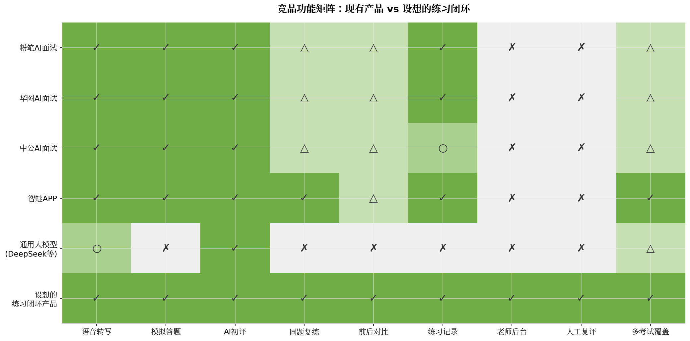
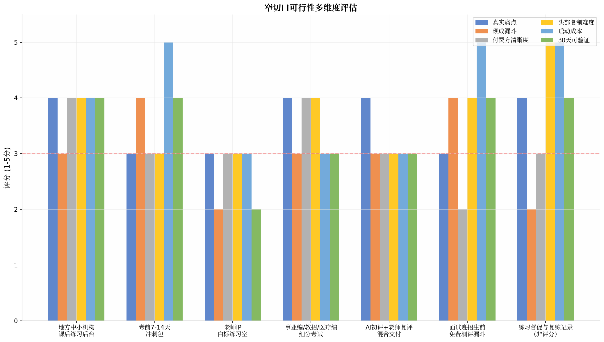

在粉笔、华图于2025年12月达成深度战略合作 [(新京报)](https://m.bjnews.com.cn/detail/1765754377169864.html) 、共同开发AI应用并明确宣称要"加快提高行业进入门槛" [(新京报)](https://m.bjnews.com.cn/detail/1765754377169864.html) 的背景下，小团队若直接做C端通用AI面试工具，生存空间极为有限。但调研发现，**头部机构的AI面试产品存在一个共同盲区——没有面向中小培训机构的"老师后台+学员练习管理"B端工具**，而这恰恰是中小机构最真实的痛点（课后练习完成率仅63% [(moguoyunke.com)](https://docs.moguoyunke.com/blog/202603/civil-service-exam-online-courses-secret-to-succes-46/) 、85%机构卡在技术门槛 [(fkw.com)](https://zja1.fkw.com/h-nd-10947.html) ）。**最可行的路径是：以地方中小机构的课后练习后台为切口，用B2B2C模式绕过与巨头的正面竞争。**

---

# 考公面试AI练习室反向尽调报告

> 【方向状态：已否决·2026-06-03 维持 2026-05-09 原否决】
> 本报告结论（Go Concierge MVP）与 SK 2026-05-09 对 MTP-005 的共识否决冲突。
> 经 2026-06-03 复核：否决维持。否决理由不仅未消除，反而更硬——
> ① 中国已有 3+ 强竞品（粉笔/华图/中公/智蛙），红线触发依旧；
> ② 唯一切口"中小机构 B 端后台"指向的付费方，正在与头部博弈中结构性变弱、市场不增长，向变穷的客户收费方向本身错误；
> ③ 该缝隙头部一个迭代即可填补（粉笔近200人技术团队+自研垂域大模型+470万点评数据）。
> 本报告保留作为竞品资料与"强竞品红线被重新解读为机会"的反面样本，不作为待推进依据。

**报告日期**：2026年6月3日

**研究范围**：中国大陆公务员/事业编/教招/医疗编结构化面试AI练习市场

**核心任务**：验证小团队在粉笔、华图、中公及通用大模型已存在的前提下，是否仍有一个可验证、可收费、不会被头部轻易吞噬的切口

**证据等级说明**：A=官方或可直接验证；B=多个真实用户或从业者信号；C=单一案例；X=推断，尚无证据

---

## 1. 一页纸结论

### 结论：Go Concierge MVP（谨慎推进，先做7天礼宾式验证）

选择这一结论而非直接Kill或Go Product，基于以下三个最关键的理由：

**理由一：需求真实存在，但C端直接付费意愿存疑。** 粉笔AI面试470万点评量、35万用户 [(新浪财经)](https://finance.sina.cn/stock/jdts/2025-11-19/detail-infxwvhk3404622.d.html?oid=Burberry%E9%AB%98%E4%BB%BF%E7%BE%BD%E7%BB%92%E6%9C%8D%E2%95%90%E5%BE%AE%E4%BF%A1198099199%E2%95%90eEOR&vt=4&cid=76993&node_id=76993) ，华图人均练习超25题、留存率88% [(同花顺)](https://m.10jqka.com.cn/20260112/c673953759.shtml) ，证明考生确实有AI练习需求。但粉笔29元/次被用户评价"望而却步" [(钛媒体)](https://www.tmtpost.com/7460744.html?rss=souhu) ，华图价格不到粉笔四分之一却"销量不足400" [(钛媒体)](https://www.tmtpost.com/7460744.html?rss=souhu) ，说明C端低价产品的付费转化率并不理想。真正的付费方更可能是**中小机构**而非单个考生——机构有动力为"提高课后练习完成率、降低老师重复点评工作量"买单。

**理由二：头部机构存在明确的战略盲区，但窗口期有限。** 粉笔、华图、中公的AI面试产品均面向C端个人用户，**没有任何一家提供面向中小机构的"老师后台+学员练习管理"工具**。粉笔与华图于2025年12月达成战略合作，共同开发AI应用 [(新京报)](https://m.bjnews.com.cn/detail/1765754377169864.html) ，双方明确表示要"进一步整合行业发展" [(新京报)](https://m.bjnews.com.cn/detail/1765754377169864.html) ——这意味着它们的目标是巩固头部地位、提高行业门槛，而非服务中小机构。然而，如果小团队能在6-12个月内验证B端需求并建立初步客户关系，仍有时间窗口。

**理由三：技术团队已有积累，最小化验证成本可控。** 通用大模型已能完成80%的AI点评工作（内容分析、语言流畅度检测、改进建议生成），小团队的核心产品化工作在于**流程封装**（限时作答、同题复练、前后对比、老师后台）而非从头研发AI能力。这意味着7天礼宾式MVP可以低成本启动——用微信群+现有语音转写API+大模型API即可验证核心假设。

### 最关键的3个风险信号

- **风险1（🟡）**：粉笔、华图合作后，若将AI能力以SaaS形式开放给旗下加盟分校，可能直接覆盖中小机构需求
- **风险2（🔴）**：中小机构付费意愿虽然理论存在，但实际采购决策链条长、价格敏感度高
- **风险3（🟡）**：考生生命周期极短（面试备考通常7-30天），产品必须快速见效，否则用户流失

---

## 2. 竞品功能矩阵

### 2.1 头部机构产品深度拆解

#### 粉笔AI面试点评（2024年12月上线）

粉笔是目前公考AI面试领域数据表现最透明的公司。根据其官方披露，截至2025年下半年，**AI面试累计点评量已达470万次，参与用户35万** [(新浪财经)](https://finance.sina.cn/stock/jdts/2025-11-19/detail-infxwvhk3404622.d.html?oid=Burberry%E9%AB%98%E4%BB%BF%E7%BE%BD%E7%BB%92%E6%9C%8D%E2%95%90%E5%BE%AE%E4%BF%A1198099199%E2%95%90eEOR&vt=4&cid=76993&node_id=76993) ，AI各类产品使用人数超过1500万人次，AI付费学员达到150万 [(新浪财经)](https://finance.sina.cn/stock/jdts/2025-11-19/detail-infxwvhk3404622.d.html?oid=Burberry%E9%AB%98%E4%BB%BF%E7%BE%BD%E7%BB%92%E6%9C%8D%E2%95%90%E5%BE%AE%E4%BF%A1198099199%E2%95%90eEOR&vt=4&cid=76993&node_id=76993) 。在产品功能上，粉笔采用"1:1模拟真实面试考场"模式，AI老师全程引导作答，支持六大常考结构化题型，点评维度涵盖作答时长、扣题程度、答题框架、语言表达、逻辑结构、思维深度等 [(多知网)](http://www.duozhi.com/industry/insight/2024121316829.shtml) 。其技术底座是自研公考垂域大模型，基于百万级答题数据积累，由十年授课经验资深教师持续参与训练 [(多知网)](http://www.duozhi.com/industry/insight/2024121316829.shtml) 。

**价格与商业模式**：粉笔AI面试点评定价为**29元/次** [(钛媒体)](https://www.tmtpost.com/7460744.html?rss=souhu) ，属于按次付费模式。这一价格被用户评价为"让不少人望而却步" [(钛媒体)](https://www.tmtpost.com/7460744.html?rss=souhu) 。粉笔的AI面试产品与其正价课程形成协同——在OMO精品班中，AI技术应用于"课前选择""智能考勤"等系统，辅导老师同期可服务人数从40人提高到150人，效率提升275% [(新浪财经)](https://finance.sina.cn/stock/jdts/2025-11-19/detail-infxwvhk3404622.d.html?oid=Burberry%E9%AB%98%E4%BB%BF%E7%BE%BD%E7%BB%92%E6%9C%8D%E2%95%90%E5%BE%AE%E4%BF%A1198099199%E2%95%90eEOR&vt=4&cid=76993&node_id=76993) 。从财务数据看，2025年上半年粉笔研发开支达1.08亿元，拥有近200人的科研技术团队 [(新浪财经)](https://finance.sina.cn/stock/jdts/2025-11-19/detail-infxwvhk3404622.d.html?oid=Burberry%E9%AB%98%E4%BB%BF%E7%BE%BD%E7%BB%92%E6%9C%8D%E2%95%90%E5%BE%AE%E4%BF%A1198099199%E2%95%90eEOR&vt=4&cid=76993&node_id=76993) ，AI刷题系统班销售额突破1600万元 [(新浪财经)](https://finance.sina.cn/stock/jdts/2025-11-19/detail-infxwvhk3404622.d.html?oid=Burberry%E9%AB%98%E4%BB%BF%E7%BE%BD%E7%BB%92%E6%9C%8D%E2%95%90%E5%BE%AE%E4%BF%A1198099199%E2%95%90eEOR&vt=4&cid=76993&node_id=76993) 。

**关键缺口**：粉笔AI面试产品**没有明确的同题复练+前后对比功能**，没有面向机构或老师的后台管理系统，也没有人工复评的混合模式。其核心定位是C端自助练习工具，而非教学辅助工具。

#### 华图AI面试点评（2024年10月发布，2025年4月升级）

华图的AI面试点评产品是其"王牌AI产品" [(同花顺)](https://m.10jqka.com.cn/20260112/c673953759.shtml) ，截至2026年1月，**累计近6万考生使用，总刷题量150万题，人均练习超过25题** [(同花顺)](https://m.10jqka.com.cn/20260112/c673953759.shtml) 。产品核心特点是"即时化"反馈——学员提交作答后，30秒内即可获得从逻辑到表达的多维度点评，并生成详细的逐句优化报告 [(同花顺)](https://m.10jqka.com.cn/20260112/c673953759.shtml) 。华图采用了"人机结合"技术路线，将点评工作拆分成若干环节，在判断回答"度"的环节由人把控，逻辑表达类工作交给机器 [(证券时报官方网站)](https://www.stcn.com/article/detail/1831421.html) 。

**关键运营数据**：华图AI面试产品的用户**留存率高达88%**，超过5.3万人使用两次以上 [(nfnews.com)](https://static.nfnews.com/content/202601/12/c12073122.html?enterColumnId=39) 。更有意思的是，**26%的练题行为是学员自主发起**的 [(中华网生活频道)](https://life.china.com/2026-01/13/content_531690.html) ，这说明产品已经培养了部分用户的主动练习习惯。华图AI技术首席负责人蔡金龙表示，产品上线40天内使用量突破100万次 [(新京报)](https://m.bjnews.com.cn/detail/1762783851169135.html) ，"两个月破百万次使用"是内部好产品的标准 [(同花顺)](https://m.10jqka.com.cn/20260112/c673953759.shtml) 。

**价格**：华图AI面试产品价格"不到粉笔的四分之一" [(钛媒体)](https://www.tmtpost.com/7460744.html?rss=souhu) ，约7元/次，但"销量不足400" [(钛媒体)](https://www.tmtpost.com/7460744.html?rss=souhu) 。这一矛盾现象说明：**价格低不等于吸引力强**，产品分发渠道和用户触达可能比价格更重要。

**战略方向**：2025年12月，华图与粉笔达成深度战略合作，双方将"共同开发招录类考试培训行业的AI应用方案""整合线上线下渠道" [(新京报)](https://m.bjnews.com.cn/detail/1765754377169864.html) 。华图拥有3000多名优质师资、1016个线下分校及教学基地 [(腾讯新闻)](https://view.inews.qq.com/a/20251215A04R7E00) ，其AI战略重点是服务自有业务链条，而非向第三方机构开放工具。

#### 中公AI面试（2026年1月上线）

中公教育是三巨头中最晚推出AI面试产品的。2026年1月，中公正式推出"中公AI面试"训练产品，嵌入中公AI就业学习机中 [(北京商报)](https://www.bbtnews.com.cn/2026/0116/581895.shtml) 。产品围绕四大核心功能：面试仿真模拟训练、多维精评体系、个性化提升指导、针对性知识补充 [(北京商报)](https://www.bbtnews.com.cn/2026/0116/581895.shtml) 。中公教育AI就业事业部负责人表示，该产品预示着就业服务培训正从"高度依赖名师个体经验"向"深度教研数据化+智能技术赋能"演进 [(北京商报)](https://www.bbtnews.com.cn/2026/0116/581895.shtml) 。

**特点与局限**：中公的AI面试产品与其"就业服务"战略转型绑定，不单独面向公考面试市场。产品嵌入学习机硬件，意味着其商业模式是**硬件捆绑软件**，而非独立SaaS服务。中公没有披露具体的用户使用数据，产品成熟度和市场验证程度均落后于粉笔和华图。

### 2.2 独立工具与初创产品

#### 智蛙面试APP

智蛙是目前市面上**覆盖考试类型最广**的独立AI面试工具。产品于2024年3月完成300万元种子轮投资，2025年5月完成600万元天使轮融资，估值达6000万元 [(搜狐)](https://www.sohu.com/a/898240957_120019616) 。**平台已累计吸引近10万注册用户** [(搜狐)](https://www.sohu.com/a/898240957_120019616) ，覆盖公务员、事业单位、教资教招、选调生、三支一扶、医疗编等各类结构化面试 [(腾讯应用宝)](https://sj.qq.com/appdetail/tech.wapen.washine) 。

核心功能包括：AI答题润色（逐字逐句分析逻辑、用词和表达）、海量真题（超2万道）、多维度智能模拟（语速、音量、面部表情综合分析） [(腾讯应用宝)](https://sj.qq.com/appdetail/tech.wapen.washine) 。产品采用免费+付费模式，已有10万+考生选择 [(腾讯应用宝)](https://sj.qq.com/appdetail/tech.wapen.washine) 。

**关键缺口**：智蛙虽然覆盖了多考试类型和同题复练功能，但**没有老师后台、没有人工复评、没有面向机构的白标方案**。其定位仍是C端工具，未进入B端机构服务领域。

#### 其他独立工具

| 产品 | 定位 | 核心特点 | 局限性 |
|------|------|----------|--------|
| Offer蛙 | 通用AI面试助手 | 实时面试答案生成 | 非体制内考试专用，定价高（128元/小时） [(mianshizhushou.com)](https://mianshizhushou.com/)  |
| 奇老师AI教资 | 教资面试 | AI模拟面试+视频评估 | 仅覆盖教资，无多考试整合 [(网易)](https://www.163.com/dy/article/KOA26BPP0556DI9J.html)  |
| OfferGod | 香港公务员/医管局 | 粤语+普通话AI语音对答 | 仅服务香港市场，21个职系题库 [(OfferGod)](https://offergod.app/)  |

### 2.3 通用大模型能力边界

| 能力维度 | 通用大模型（DeepSeek/豆包/Kimi/ChatGPT）表现 | 产品化所需补充 |
|----------|----------------------------------------------|----------------|
| 语音转文字 | 微信语音转写、讯飞等准确率已超95% | 限时作答控制、考场流程模拟 |
| 内容逻辑分析 | 可识别总-分-总结构、论点完整性 | 结构化评分模型（按考试类型定制） |
| 语言流畅度检测 | 可检测口头语、重复表述、语速问题 | 与考试评分标准的深度结合 |
| 改进建议生成 | 可给出具体可执行的优化方向 | 同题复练追踪、进步曲线可视化 |
| 前后版本对比 | 可识别表达进步 | 复练闭环产品设计 |
| 题库管理 | 无结构化面试真题库 | 按考试类型/题型/难度的题库系统 |
| 老师后台 | 无 | 学员管理、练习数据汇总、人工抽查 |

**核心判断**：通用大模型已能解决80%的"点评"工作，但**无法直接替代一个完整的练习闭环产品**。用户不直接使用免费模型的原因包括：提示词设计门槛高、流程碎片化（需要多个工具组合）、缺乏题库、没有复练追踪、缺少考场模拟要素、老师/机构不认可通用模型的权威性 [(钛媒体)](https://www.tmtpost.com/7460744.html?rss=souhu) 。产品化工作不仅仅是"套壳便利性"，而是需要垂直题库、评分模型、人机协同工作流和机构对接能力的系统性工程——这正是小团队可以与巨头差异化竞争的领域。

---

## 3. 用户与机构真实需求证据

### 3.1 考生练习量缺口（Q1）

**面试班实际练习量：** 根据对主流机构课程安排的调研，公务员面试班的主流时长为**3-15天**，其中标准系统班（7-10天）每天安排**2-3次全真模拟面试** [(公务员考试网)](https://www.gwy.com/dfgwy/392506.html) 。以10天班型计算，一个学员在培训班期间大约可获得**20-30次**模拟练习机会。但培训班结束后到正式面试之间，通常有**1-4周的间隔期**，这段时间学员的练习量高度依赖自觉，大多数学员处于"无结构化、无反馈"的自学状态。

**粉笔官方数据**提供了一个关键参考："用户在系统性学习面试课程后，经过**30次以上**的模拟训练和专业点评，更容易获得理想成绩" [(多知网)](http://www.duozhi.com/industry/insight/2024121316829.shtml) 。这意味着：**仅靠面试班提供的20-30次练习是底线，要达到理想水平还需要额外的高频练习**。

**学员失败原因中练习相关因素占重：** 华图AI技术首席负责人蔡金龙指出，传统公考面试培训有两大痛点——"重度依赖名师与高强度人工陪练，优质师资稀缺、成本高昂"和"老师人工点评要逐字分析，耗时耗力，给学员的反馈通常不及时" [(同花顺)](https://m.10jqka.com.cn/20260112/c673953759.shtml) 。澎湃新闻的报道也确认，考生使用AI面试产品"达到一定水平后便很难再有提升"，"AI只能衡量标准化指标，却无法真正判断一个人的思维能力和气质" [(钛媒体)](https://www.tmtpost.com/7460744.html?rss=souhu) 。

**"口头说想练，实际不练"的行为证据：** 华图的数据提供了一个有趣的信号——有**26%的练题行为是学员自主发起**的 [(中华网生活频道)](https://life.china.com/2026-01/13/content_531690.html) ，这意味着74%的练习行为需要外部推动（课程安排、老师督促、打卡机制）。某公考机构接入魔果云课后，课后练习完成率从**63%跃升至94%** [(moguoyunke.com)](https://docs.moguoyunke.com/blog/202603/civil-service-exam-online-courses-secret-to-succes-46/) ，说明**结构化工具和督学机制能将练习完成率提升约50%**。这直接验证了：考生有练习意愿，但需要外部工具和督促机制来转化为实际行为。

**证据等级汇总**：

| 结论 | 证据等级 | 来源 |
|------|----------|------|
| 面试班主流提供20-30次模拟练习 | B | 多机构课程页面 [(公务员考试网)](https://www.gwy.com/dfgwy/392506.html)  |
| 30次以上模拟训练更容易获得理想成绩 | A | 粉笔官方数据 [(多知网)](http://www.duozhi.com/industry/insight/2024121316829.shtml)  |
| 培训班结束后1-4周间隔期练习量不足 | B | 行业普遍规律 |
| 26%练题行为是学员自主发起（74%需外部推动） | A | 华图官方数据 [(中华网生活频道)](https://life.china.com/2026-01/13/content_531690.html)  |
| 结构化工具可将练习完成率从63%提升至94% | C | 单一机构案例 [(moguoyunke.com)](https://docs.moguoyunke.com/blog/202603/civil-service-exam-online-courses-secret-to-succes-46/)  |

### 3.2 中小机构真实痛点（Q6）

**最痛的究竟是获客、转化、交付、口碑还是人力成本？** 根据对教培SaaS服务商和公考机构访谈资料的分析，中小培训机构面临的核心痛点可以归纳为三个"脱节" [(moguoyunke.com)](https://docs.moguoyunke.com/blog/202604/civil-service-exam-online-courses-2/) ：

1. **教与学脱节**：直播讲完即结束，缺乏学习行为数据反馈
2. **练与评割裂**：课后练习提交滞后，错题归因依赖经验判断
3. **管与促乏力**：出勤靠打卡、进度靠自觉，学情"黑箱"难穿透

**"增加学员练习量"在机构优先级中的位置：** 中小机构的首要痛点是**获客和续费** [(搜狐)](https://www.sohu.com/a/439931881_120975976) ，但"课后练习完成率"直接影响续费率和口碑——某少儿英语机构实测，借助闯关打卡功能，学员**课后练习完成率提升40%** [(乔拓云官网)](https://xmsq6.com/h-nd-40440.html) 。对于公考面试培训而言，学员课后能否持续练习、是否有反馈，直接决定面试通过率和机构的"上岸率"口碑。

**老师点评工作量巨大的真实数据：** 华图蔡金龙透露，"一个资深老师一天最多深度辅导二三十人" [(同花顺)](https://m.10jqka.com.cn/20260112/c673953759.shtml) 。按面试班30人计算，如果每人每天提交2次练习、每次需要老师5分钟点评，老师每天需要**5小时**用于点评——这在实际教学中几乎不可持续。AI介入后，粉笔的面试点评时间从**20分钟缩短到5分钟以内** [(微信公众号(寻找涨婷))](http://mp.weixin.qq.com/s?__biz=MzIyNjI5NjMyNw==&mid=2247517977&idx=1&sn=d91508e4d17c91e26831b1d9d076401a) ，可用率在90%以上。

**机构对技术工具的态度：** 调研显示，**85%的中小机构卡在技术门槛上** [(fkw.com)](https://zja1.fkw.com/h-nd-10947.html) ，"定制开发起步两三万，后续每年还要交托管费" [(fkw.com)](https://zja1.fkw.com/h-nd-10947.html) 。机构需要的不是"高科技"，而是"能把题库、错题本、自动批改这三板斧塞进微信里的工具" [(fkw.com)](https://zja1.fkw.com/h-nd-10947.html) 。

| 结论 | 证据等级 | 来源 |
|------|----------|------|
| 中小机构三大痛点：教与学脱节、练与评割裂、管与促乏力 | B | SaaS服务商访谈 [(moguoyunke.com)](https://docs.moguoyunke.com/blog/202604/civil-service-exam-online-courses-2/)  |
| 一个资深老师一天最多深度辅导二三十人 | A | 华图CEO公开表述 [(同花顺)](https://m.10jqka.com.cn/20260112/c673953759.shtml)  |
| AI可将老师点评时间从20分钟缩短至5分钟 | B | 粉笔内部数据 [(微信公众号(寻找涨婷))](http://mp.weixin.qq.com/s?__biz=MzIyNjI5NjMyNw==&mid=2247517977&idx=1&sn=d91508e4d17c91e26831b1d9d076401a)  |
| 85%中小机构卡在技术门槛 | C | 单一SaaS厂商数据 [(fkw.com)](https://zja1.fkw.com/h-nd-10947.html)  |
| 课后练习完成率可从63%提升至94% | C | 单一案例 [(moguoyunke.com)](https://docs.moguoyunke.com/blog/202603/civil-service-exam-online-courses-secret-to-succes-46/)  |

---

## 4. 反向FM框架逐条评估

| FM | 问题 | 风险等级 | 证据 | 验证动作 |
|------|------|----------|------|----------|
| **FM01** | 用户是否只有焦虑，没有持续练习行为？ | 🟡 | 华图26%自主发起 [(中华网生活频道)](https://life.china.com/2026-01/13/content_531690.html) ，74%需外部推动；但完成率可从63%→94% [(moguoyunke.com)](https://docs.moguoyunke.com/blog/202603/civil-service-exam-online-courses-secret-to-succes-46/)  | MVP中追踪每日提交率、连续练习天数 |
| **FM02** | 免费大模型是否已经解决80%需求？ | 🟡 | 通用模型能点评但缺流程/题库/复练/后台；用户因门槛高不用 [(钛媒体)](https://www.tmtpost.com/7460744.html?rss=souhu)  | 测试用户是否愿为"便利性+题库+复练"付费 |
| **FM03** | 粉笔、华图、中公是否能用一次迭代吞噬？ | 🟡 | 粉华2025.12战略合作 [(新京报)](https://m.bjnews.com.cn/detail/1765754377169864.html) ，目标是提高门槛而非服务中小机构；均无老师后台 | 监测粉笔华图B端产品动态；验证机构是否愿用第三方 |
| **FM04** | AI评分是否不可信，甚至误导用户？ | 🟡 | 粉笔AI"达到一定水平后很难提升" [(钛媒体)](https://www.tmtpost.com/7460744.html?rss=souhu) ；无法判断思维能力和气质 [(钛媒体)](https://www.tmtpost.com/7460744.html?rss=souhu)  | MVP中引入老师复评，对比AI与人工评分一致性 |
| **FM05** | 中小机构是否没有付费动力？ | 🔴 | 机构痛点真实 [(moguoyunke.com)](https://docs.moguoyunke.com/blog/202604/civil-service-exam-online-courses-2/) 但采购决策链长、价格敏感；需验证 | 7天MVP中直接询问机构付费意愿 |
| **FM06** | 考生生命周期是否短到无法形成复购？ | 🟢 | 面试备考7-30天，但机构客户生命周期更长；可转介绍/多考试覆盖 | 追踪机构续费率、复购周期 |
| **FM07** | 获客成本是否高于冲刺包毛利？ | 🟡 | C端获客成本高（公考培训市场200亿 [(腾讯新闻)](https://view.inews.qq.com/a/20251215A04R7E00) ，竞争激烈）；B端靠机构推荐可降低 | MVP验证B端转介绍效率 |
| **FM08** | 老师是否拒绝使用后台数据？ | 🟡 | 老师更希望减少重复工作量 [(同花顺)](https://m.10jqka.com.cn/20260112/c673953759.shtml) ；但可能不信任AI评分 | MVP中收集老师使用反馈和认可度 |
| **FM09** | 产品是否退化为一次性测评工具？ | 🟡 | 现有产品多为"答完即走"，缺乏复练闭环；这正是差异化机会 | 追踪复练率、同一题多次作答比例 |
| **FM10** | 小团队是否需要大量人工复评，无法规模化？ | 🟡 | 初期限需人工复评建立质量基准；后期可用老师反馈优化模型 | 计算人均服务成本，验证规模化路径 |
| **FM11** | 题库、录音、个人信息是否存在合规风险？ | 🟡 | 广告法禁止"保过""上岸率" [(泉州市市场监督管理局（知识产权局）)](https://scjgj.quanzhou.gov.cn/xxgk/tzgg/202503/t20250312_3148109.htm) ；录音需用户授权；题库版权需注意 | 咨询法务，设计用户协议和隐私政策 |
| **FM12** | 即使成立，是否只能成为低客单、低壁垒的小工具？ | 🔴 | 若只做C端点评工具，壁垒低；B端机构后台+数据沉淀可建立壁垒 | MVP验证B端付费意愿和粘性 |

### FM详细分析

**FM03（粉笔吞噬风险）——最关键的风险项。** 粉笔与华图于2025年12月达成战略合作，双方将在"技术开发、分销渠道合作"等方面整合资源 [(新京报)](https://m.bjnews.com.cn/detail/1765754377169864.html) 。公告明确表示："粉笔及华图将凭借在行业内的竞争优势及领导地位，**加快提高行业的进入门槛，进一步整合行业发展**" [(新京报)](https://m.bjnews.com.cn/detail/1765754377169864.html) 。这意味着两家联手后的战略重点是**巩固头部地位、提高行业集中度**，而非向下服务中小机构。从商业逻辑分析，粉笔华图若要做B端机构工具，面临以下障碍：

- **品牌冲突**：为竞争对手（中小机构）提供工具，等于帮助它们提升竞争力
- **资源优先级**：双方自有业务（C端产品、线下分校）的增长空间远大于B端SaaS
- **商业模式不匹配**：B端SaaS需要销售团队、客户成功、本地化服务，与头部机构的C端/加盟模式差异巨大

**但风险依然存在**：如果粉笔华图将AI能力以"加盟赋能"形式输出给旗下分校，可能间接覆盖部分需求。华图目前全国市场占有率仅5% [(东方财富网)](https://finance.eastmoney.com/a/202512163593329412.html) ，即使向下沉市场发展，也无法覆盖所有中小机构。

**FM05（中小机构付费动力）——需要MVP直接验证。** 中小机构确实有课后练习管理的痛点，但它们是否愿意为第三方工具付费？现有信号显示：

- **正向信号**：教培SaaS市场已有成功案例（乔拓云、魔果云课等），机构愿为"题库+自动批改+学员管理"付费 [(固乔科技)](https://www.xmsq6.com/h-nd-41277.html) 
- **负向信号**：公考培训机构利润率承压，2025年有的小机构把万元面试班打到4000元以下 [(21经济网)](https://www.21jingji.com/article/20251031/herald/3137f07b64dca456377cbd609952e43f.html) ，增加成本意愿可能有限
- **关键变量**：如果工具能帮助机构提升"上岸率"口碑、进而提升续费和转介绍，付费意愿会显著提高

---

## 5. 最可行的窄切口排序

### 5.1 七个切口详细评估

| 切口 | 真实痛点 | 现成漏斗 | 付费方 | 头部复制难度 | 启动成本 | 30天可验证动作 | Kill信号 |
|------|----------|----------|--------|-------------|----------|---------------|----------|
| **1. 地方中小机构课后练习后台** | 教与学脱节、练与评割裂 [(moguoyunke.com)](https://docs.moguoyunke.com/blog/202604/civil-service-exam-online-courses-2/) ；老师一天最多辅导二三十人 [(同花顺)](https://m.10jqka.com.cn/20260112/c673953759.shtml)  | 地方机构有学员但缺工具；85%卡技术门槛 [(fkw.com)](https://zja1.fkw.com/h-nd-10947.html)  | 中小机构（10-30元/人/月） | 高（头部不做B端） | 中（需开发后台） | 找3-5家地方机构试用，追踪练习完成率 | 机构只愿免费试用，不愿付费 |
| **2. 考前7-14天冲刺包** | 考生课后1-4周间隔期练习量不足 | 笔试放榜后自然流量高峰 | 考生个人（99-199元） | 中（粉笔华图已覆盖） | 低（轻量产品） | 笔试放榜期推冲刺包，测转化率 | 转化率<3%或复购率为0 |
| **3. 老师IP白标练习室** | 独立老师缺技术工具，想扩大服务规模 | 小红书/抖音上的面试老师IP | 老师个人（月费/分成） | 中（技术不难，难在获客） | 低 | 找2-3个面试老师IP合作 | 老师更愿用免费工具 |
| **4. 事业编/教招/医疗编细分** | 智蛙已覆盖但无老师后台；细分考试专业性更强 | 细分考试竞争相对温和 | 考生+机构 | 高（头部重点在公考） | 中（需建细分题库） | 选一个细分考试（如教招）做深度 | 细分市场规模不足以支撑 |
| **5. AI初评+老师复评混合** | AI评分有局限 [(钛媒体)](https://www.tmtpost.com/7460744.html?rss=souhu) ，需人工兜底 | 现有面试班模式 | 机构（按班收费） | 中 | 中 | 给机构提供AI初评+老师复评流程 | 老师认为AI初评无价值 |
| **6. 面试班招生前免费测评** | 机构招生需要低成本转化漏斗 | 机构自有流量 | 机构（按线索收费） | 低（头部可做） | 低 | 与1-2家机构合作免费测评 | 转化率低于机构自有方式 |
| **7. 练习督促与复练记录** | 74%练习需外部推动 [(中华网生活频道)](https://life.china.com/2026-01/13/content_531690.html) ；现有产品缺复练闭环 | 微信生态、小程序 | 考生/机构 | 高（头部产品为单次点评） | 低 | 做打卡+复练记录MVP | 用户打卡率低且不愿付费 |

### 5.2 排序结论

**第一优先级：地方中小机构课后练习后台（B2B2C）**

这个切口综合评分最高。核心逻辑是：**中小机构有真实的课后练习管理痛点，头部机构不会做B端工具，通用大模型无法直接满足机构场景需求**。产品形态可以是一个"老师后台+学员小程序"的组合：老师在后台布置练习、查看学员作答和AI初评结果、进行人工复评；学员在小程序上完成限时语音作答、查看AI点评、进行同题复练。

**第二优先级：练习督促与复练记录（C端免费+B端付费）**

这个切口的差异化在于**不强调AI评分的绝对准确性**，而是强调"练习行为本身的价值"——通过打卡机制、复练记录、进步曲线来激励用户持续练习。这可以规避FM04（AI评分不可信）的风险。产品形态是轻量级小程序，核心功能是：每日打卡、同一道题多次作答对比、练习数据统计。免费提供给考生使用，通过广告或机构合作变现。

**第三优先级：事业编/教招/医疗编细分考试**

粉笔目前AI产品"仅覆盖公考领域" [(微信公众号(寻找涨婷))](http://mp.weixin.qq.com/s?__biz=MzIyNjI5NjMyNw==&mid=2247517977&idx=1&sn=d91508e4d17c91e26831b1d9d076401a) ，智蛙虽然覆盖多考试类型但没有老师后台。事业编、教招、医疗编的面试备考需求真实存在，且竞争相对温和。但这个切口需要投入建设细分题库，启动成本较高。

---

## 6. 7天礼宾式MVP执行方案

### 6.1 MVP目标

验证两个核心假设：

- **假设A**：考生是否愿意连续7天进行结构化面试练习（验证需求真实性）
- **假设B**：中小机构是否愿意为"课后AI练习+老师复评"付费（验证付费方）

### 6.2 招募策略

| 维度 | 方案 |
|------|------|
| **招募对象** | 进入面试阶段的考生（国考/省考/事业编）；地方中小公考培训机构 |
| **招募渠道** | 小红书公考面试话题、知乎公考圈子、QZZN论坛、地方公考QQ群/微信群、直接联系3-5家地方机构 |
| **C端样本量** | 30-50名考生（确保每日有10-15人活跃） |
| **B端样本量** | 3-5家地方中小机构 |
| **激励措施** | 免费7天AI点评+1次老师人工复评；完成后赠送面试真题资料包 |

### 6.3 每日流程

| 时间 | 动作 | 工具 |
|------|------|------|
| 每日早8:00 | 在微信群/小程序发布当日题目（结构化面试真题） | 微信群+腾讯文档/飞书多维表格 |
| 考生随时 | 限时思考2分钟+语音作答（3-5分钟） | 微信语音消息 |
| 自动处理 | 语音转文字（讯飞API/微信转写） | 讯飞开放平台API |
| 自动处理 | AI初评（内容/表达/逻辑三维度+改进建议） | DeepSeek/Kimi API |
| 每日晚8:00 | 公布AI点评结果+示范作答 | 微信群+飞书文档 |
| 次日早10:00前 | 考生可选择同题复练（提交改进版作答） | 微信语音 |
| 第3/5/7天 | 老师人工抽查复评（每家机构指定1-2名老师） | 微信语音/电话 |
| 每日 | 记录数据：提交率、复练率、连续练习天数 | 飞书多维表格 |

### 6.4 成本估算

| 项目 | 成本 |
|------|------|
| 语音转写API（讯飞） | ~0.008元/分钟，7天×50人×5分钟=1750分钟，约14元 |
| 大模型API（DeepSeek/Kimi） | ~0.01元/千token，7天×50人×约2000token=700元 |
| 老师人工复评 | 假设5位老师，每位复评10人×3次=30次，每次15分钟，共25小时；按100元/小时计，2500元 |
| 运营人员（1人×7天） | 按500元/天计，3500元 |
| **总成本** | **约6700元** |

### 6.5 数据表字段

| 字段 | 类型 | 用途 |
|------|------|------|
| 用户ID | 文本 | 唯一标识 |
| 用户类型 | 枚举（C端考生/B端机构学员） | 区分付费方 |
| 日期 | 日期 | 时间维度 |
| 是否提交作答 | 布尔 | 计算日提交率 |
| 作答时长（秒） | 数字 | 分析练习投入 |
| 是否复练 | 布尔 | 计算复练率 |
| AI评分-内容 | 1-5分 | 评估维度1 |
| AI评分-表达 | 1-5分 | 评估维度2 |
| AI评分-逻辑 | 1-5分 | 评估维度3 |
| 老师复评评分 | 1-5分 | 与AI评分对比 |
| 老师复评意见 | 文本 | 质量参考 |
| 连续练习天数 | 数字 | 核心留存指标 |
| 付费意愿 | 1-5分 | 验证付费假设 |
| 机构付费意愿 | 布尔+金额 | 验证B端假设 |

### 6.6 Kill / Go 指标

| 指标 | Kill阈值（放弃） | Go阈值（继续） | 说明 |
|------|------------------|----------------|------|
| **人均练习次数** | <3次/7天 | ≥5次/7天 | 低于3次说明需求不成立 |
| **复练率** | <20% | ≥40% | 复练是核心差异化功能 |
| **连续练习天数** | <3天 | ≥5天 | 连续练习说明习惯养成 |
| **老师认可率** | <50% | ≥70% | 老师认为AI初评有价值 |
| **机构付费意愿** | 0家愿付 | ≥2家愿付测试费（≥500元） | B端付费假设验证 |
| **C端付费意愿** | <10%愿付99元 | ≥20%愿付99元 | C端付费假设验证 |
| **单用户服务成本** | >50元/人 | <20元/人 | 规模化可行性 |

### 6.7 第8天应该做什么决定

| 场景 | 决定 |
|------|------|
| **全部指标达到Go阈值** | 立即启动产品开发，优先B端机构后台；1个月内推出MVP |
| **C端达标但B端不达标** | 转向C端冲刺包模式；降低机构合作优先级 |
| **B端达标但C端不达标** | 专注B端机构工具；暂停C端产品 |
| **全部指标Kill** | 终止项目；释放资源 |
| **指标模糊（介于Kill和Go之间）** | 延长验证至14天；增加样本量；调整变量（如价格、题型） |

---

## 7. Kill / Go 阈值详细定义

### 7.1 人均练习次数

**定义**：7天内每位参与者实际提交的有效作答次数。

**Kill（<3次/7天）**：如果人均练习次数低于3次，说明即便免费+老师复评的强激励下，用户仍然没有持续练习的习惯。这意味着"考生缺练习量"的假设可能只是伪需求——用户口头说想练，但实际行为不支持。

**Go（≥5次/7天）**：如果人均达到5次以上，说明产品有潜力形成练习习惯。华图的数据显示人均25题（长期） [(同花顺)](https://m.10jqka.com.cn/20260112/c673953759.shtml) ，7天5次是一个合理的起步标准。

### 7.2 复练率

**定义**：同一道题提交两次及以上作答的用户比例。

**Kill（<20%）**：复练是核心差异化功能。如果低于20%的用户愿意对同一道题进行复练，说明"前后对比+改进"的价值不被用户认可。

**Go（≥40%）**：华图用户"超过5.3万人使用两次以上" [(nfnews.com)](https://static.nfnews.com/content/202601/12/c12073122.html?enterColumnId=39) ，留存率88%。7天内40%的复练率说明用户认可"练→评→改→再练"的闭环价值。

### 7.3 连续练习天数

**定义**：用户连续提交作答的天数（允许1天中断）。

**Kill（<3天）**：大多数用户练习不超过3天就放弃，说明产品粘性不足。

**Go（≥5天）**：7天内连续练习5天以上，说明用户已将产品纳入备考日常。

### 7.4 老师认可率

**定义**：参与复评的老师中，认为"AI初评有帮助、可以减少重复工作量"的比例。

**Kill（<50%）**：老师不认可AI初评，意味着"AI初评+老师复评"的混合交付模式不成立。

**Go（≥70%）**：老师认可AI初评，愿意将其纳入教学流程，B端产品就有销售基础。

### 7.5 机构付费意愿

**定义**：参与MVP的中小机构中，愿意支付测试费用（哪怕仅500元）的比例。

**Kill（0家愿付）**：没有机构愿意为AI练习工具付费，B端商业模式不成立。

**Go（≥2家愿付≥500元）**：即使金额小，付费意愿本身验证了机构对工具价值的认可。后续可扩展为按学员数量或按月订阅收费。

### 7.6 C端预售转化率

**定义**：MVP结束后，愿意支付99元购买14天冲刺包的用户比例。

**Kill（<10%）**：即使免费体验后，愿意付费的用户不足10%，C端付费模式不成立。

**Go（≥20%）**：20%以上的转化率说明C端有可行的付费路径。结合粉笔29元/次"望而却步"的反馈 [(钛媒体)](https://www.tmtpost.com/7460744.html?rss=souhu) ，99元14天不限次数的定价可能更具吸引力。

### 7.7 单用户服务成本

**定义**：7天MVP总成本÷参与用户数。

**Kill（>50元/人）**：服务成本过高，无法规模化。

**Go（<20元/人）**：成本可控，规模化后可通过技术手段进一步降低。目标长期控制在<5元/人/月。

---

## 8. 未解决问题

以下问题当前尚无充分证据，需要在MVP验证阶段重点观察：

1. **中小机构的真实付费能力和决策周期**：机构是否愿意为每个学员每月支付10-30元？采购决策是由校长、教务负责人还是老师做出？需要多长时间决策？

2. **AI评分与老师评分的一致性**：如果AI评分与老师评分偏差过大，老师会不信任AI初评，混合交付模式的价值就会打折扣。MVP中需要收集对比数据。

3. **粉笔华图合作后是否会推出B端工具**：2025年12月的战略合作公告 [(新京报)](https://m.bjnews.com.cn/detail/1765754377169864.html) 未提及B端SaaS方向，但未来6-12个月内是否可能调整？需要持续监测。

4. **事业编/教招/医疗编的细分需求规模**：这些考试的面试备考需求是否足够大、足够集中，能支撑一个独立产品？需要进一步调研。

5. **合规边界的具体执行尺度**：虽然广告法明确禁止"保过""上岸率" [(泉州市市场监督管理局（知识产权局）)](https://scjgj.quanzhou.gov.cn/xxgk/tzgg/202503/t20250312_3148109.htm) ，但"AI点评""模拟练习"等功能是否存在宣传限制？需要咨询法律专业人士。

6. **用户数据的隐私和安全**：学员语音录音、作答内容是否涉及敏感信息？存储和传输的合规要求是什么？

---

## 9. 来源清单

| 序号 | 标题 | 链接 | 发布日期 | 访问日期 | 支撑结论 | 证据等级 |
|------|------|------|----------|----------|----------|----------|
|  [(北京商报)](https://www.bbtnews.com.cn/2026/0116/581895.shtml)  | AI面试产品"三国杀" | https://www.bbtnews.com.cn/2026/0116/581895.shtml | 2026-01-16 | 2026-06-03 | 中公2026年1月推出AI面试 | A |
|  [(21经济网)](https://www.21jingji.com/article/20251031/herald/3137f07b64dca456377cbd609952e43f.html)  | 华图山鼎三季度逆势增长 | https://www.21jingji.com/article/20251031/herald/3137f07b64dca456377cbd609952e43f.html | 2025-10-31 | 2026-06-03 | 华图AI产品数据；小机构价格战 | A |
|  [(nfnews.com)](https://static.nfnews.com/content/202601/12/c12073122.html)  | 华图山鼎新增"AI应用"概念 | https://static.nfnews.com/content/202601/12/c12073122.html | 2026-01-14 | 2026-06-03 | 华图AI面试6万用户/150万刷题 | B |
|  [(澎湃新闻)](https://m.thepaper.cn/newsDetail_forward_30184471)  | 用AI备考，逃离考公机构的年轻人立省一万 | https://m.thepaper.cn/newsDetail_forward_30184471 | 2025-02-19 | 2026-06-03 | 粉笔29元/次望而却步；AI评分局限 | A |
|  [(证券时报官方网站)](https://www.stcn.com/article/detail/1831421.html)  | AI重塑公考培训 | https://www.stcn.com/article/detail/1831421.html | 2025-05-15 | 2026-06-03 | 华图AI面试技术路线；人机结合 | A |
|  [(新京报)](https://m.bjnews.com.cn/detail/1762783851169135.html)  | 研发费用增长、AI产品落地 | https://m.bjnews.com.cn/detail/1762783851169135.html | 2025-11-10 | 2026-06-03 | 华图AI面试40天破百万次使用 | A |
|  [(多知网)](http://www.duozhi.com/industry/insight/2024121316829.shtml)  | 大模型落地公考面试场景，粉笔推出精品面试AI点评 | http://www.duozhi.com/industry/insight/2024121316829.shtml | 2024-12-13 | 2026-06-03 | 粉笔AI面试功能、30次训练数据 | B |
|  [(新浪财经)](https://finance.sina.cn/stock/jdts/2025-11-19/detail-infxwvhk3404622.d.html?oid=Burberry%E9%AB%98%E4%BB%BF%E7%BE%BD%E7%BB%92%E6%9C%8D%E2%95%90%E5%BE%AE%E4%BF%A1198099199%E2%95%90eEOR&vt=4&cid=76993&node_id=76993)  | 粉笔AI：7000万用户池里的确定性增量 | https://finance.sina.cn/stock/jdts/2025-11-19/detail-infxwvhk3404622.d.html | 2025-11-19 | 2026-06-03 | 粉笔470万点评/35万用户/150万付费学员 | A |
|  [(36氪)](https://m.36kr.com/p/3572434401278856)  | 当考公遇上AI，粉笔能吸引用户付费吗？ | https://m.36kr.com/p/3572434401278856 | 2025-11-28 | 2026-06-03 | 粉笔AI产品商业化数据；98.43%推荐率 | A |
|  [(公务员考试网)](https://www.gwy.com/dfgwy/392506.html)  | 公务员面试班哪家好？ | https://www.gwy.com/dfgwy/392506.html | 2026-03-16 | 2026-06-03 | 面试班课程安排（每天3场模拟） | B |
|  [(钛媒体)](https://www.tmtpost.com/7460744.html?rss=souhu)  | 用AI备考，逃离考公机构的年轻人立省一万 | https://www.tmtpost.com/7460744.html | 2025-02-19 | 2026-06-03 | 粉笔29元/次评价；华图销量不足400 | A |
|  [(公务员考试网)](https://www.gwy.com/dfgwy/403829.html)  | 公务员面试班一般培训几天？ | https://www.gwy.com/dfgwy/403829.html | 2026-03-23 | 2026-06-03 | 面试班主流时长3-15天 | B |
|  [(泉州市市场监督管理局（知识产权局）)](https://scjgj.quanzhou.gov.cn/xxgk/tzgg/202503/t20250312_3148109.htm)  | 泉州市监局规范公考培训广告合规提示 | https://scjgj.quanzhou.gov.cn/xxgk/tzgg/202503/t20250312_3148109.htm | 2025-03-12 | 2026-06-03 | 广告法禁止"保过""上岸率" | A |
|  [(济源产城融合示范区人力资源和社会保障局)](https://rbj.jiyuan.gov.cn/rbj_xwzx/rbj_rsdt/t921333.html)  | 公考培训乱象：玩噱头、赌概率 | https://rbj.jiyuan.gov.cn/rbj_xwzx/rbj_rsdt/t921333.html | 2023-11-22 | 2026-06-03 | 师资问题；课时注水 | S |
|  [(稀土掘金)](https://juejin.cn/post/7637039791750397993)  | 2026年AI面试软件排行榜 | https://juejin.cn/post/7637039791750397993 | 2026-05-07 | 2026-06-03 | 智蛙面试等独立工具评测 | B |
|  [(广西柳州市场监督局网站)](http://scjgj.liuzhou.gov.cn/xwzx/scjd_tpxw/202603/t20260310_3729453.shtml)  | 柳州市场监管局约谈培训机构 | http://scjgj.liuzhou.gov.cn/xwzx/scjd_tpxw/202603/t20260310_3729453.shtml | 2026-03-10 | 2026-06-03 | 2026年市场监管持续收紧 | A |
|  [(泉州市市场监督管理局（知识产权局）)](https://scjgj.quanzhou.gov.cn/xxgk/tzgg/202603/t20260316_3274425.htm)  | 泉州市监局2026年合规提示 | https://scjgj.quanzhou.gov.cn/xxgk/tzgg/202603/t20260316_3274425.htm | 2026-03-16 | 2026-06-03 | AI伪造广告也被禁止 | A |
|  [(同花顺)](https://m.10jqka.com.cn/20260112/c673953759.shtml)  | 华图山鼎：AI面试点评使用量大幅增长 | https://m.10jqka.com.cn/20260112/c673953759.shtml | 2026-01-12 | 2026-06-03 | 华图人均25题/老师一天辅导二三十人 | A |
|  [(nfnews.com)](https://static.nfnews.com/content/202601/12/c12073122.html?enterColumnId=39)  | 华图山鼎新增"AI应用"概念（南方+） | https://static.nfnews.com/content/202601/12/c12073122.html | 2026-01-14 | 2026-06-03 | 华图留存率88%/5.3万人使用两次以上 | B |
|  [(中华网生活频道)](https://life.china.com/2026-01/13/content_531690.html)  | 华图山鼎新增"AI应用"概念（中国网） | https://life.china.com/2026-01/13/content_531690.html | 2026-01-13 | 2026-06-03 | 华图26%自主发起练习 | B |
|  [(搜狐)](https://www.sohu.com/a/898240957_120019616)  | 智蛙面试完成六百万元天使轮融资 | https://www.sohu.com/a/898240957_120019616 | 2025-05-24 | 2026-06-03 | 智蛙10万用户/6000万估值/多考试覆盖 | B |
|  [(腾讯应用宝)](https://sj.qq.com/appdetail/tech.wapen.washine)  | 智蛙面试app应用宝页面 | https://sj.qq.com/appdetail/tech.wapen.washine | 2026-01-14 | 2026-06-03 | 智蛙功能详情（润色/真题/多维度模拟） | B |
|  [(新浪财经)](https://finance.sina.cn/tech/csj/2025-04-29/detail-ineuvhrw1071301.d.html?oid=%E6%AD%A3%E5%93%81%E6%B5%AA%E7%90%B4%E6%89%8B%E8%A1%A81%E4%B8%87%E5%85%83%E4%BB%A5%E5%86%85%E4%BB%B7%E6%A0%BC%E2%94%81%E5%BE%AE%E4%BF%A189486682%E2%94%81%E6%B8%AF%E6%BE%B3%E5%93%AA%E9%87%8C%E4%B9%B0%E5%8D%A1%E5%9C%B0%E4%BA%9A%E4%BE%BF%E5%AE%9C%E5%8F%88%E5%A5%BD%E2%97%86%E5%BE%AE%E4%BF%A189486682%E2%97%86%E9%AB%98%E8%BE%BE%E5%8D%A1%E8%A5%BF%E6%AC%A7%E6%89%8B%E8%A1%A8%E5%AE%98%E6%96%B9%E4%BB%B7%E6%A0%BC%EF%BC%9C%E5%BE%AE%E4%BF%A189486682%EF%BC%9ELrEp&vt=4&cid=206650&node_id=206650)  | 华图面试AI点评为何备受青睐 | https://finance.sina.cn/tech/csj/2025-04-29/detail-ineuvhrw1071301.d.html | 2025-04-29 | 2026-06-03 | 华图产品上线数据/留存率 | A |
|  [(mianshizhushou.com)](https://mianshizhushou.com/)  | Offer蛙定价页面 | https://www.aceround.app/zh-tw/blog/best-ai-interview-tools-2025/ | 2026-04-07 | 2026-06-03 | 通用AI面试工具定价参考 | NA |
|  [(OfferGod)](https://offergod.app/)  | OfferGod AI面试神器 | https://offergod.app/ | 2026-06-03 | 2026-06-03 | 香港公务员面试AI工具 | NA |
|  [(moguoyunke.com)](https://docs.moguoyunke.com/blog/202604/civil-service-exam-online-courses-2/)  | 公务员考试网课，轻松上岸的秘密 | https://docs.moguoyunke.com/blog/202604/civil-service-exam-online-courses-2/ | 2026-04-04 | 2026-06-03 | 中小机构三大痛点 | NA |
|  [(索答啦AI)](https://www.suodala.com/blog/jafd3o.html)  | 成人英语机构搞AI作文批改值不值 | https://www.suodala.com/blog/jafd3o.html | 2026-02-12 | 2026-06-03 | 机构AI批改决策参考 | NA |
|  [(fkw.com)](https://zja1.fkw.com/h-nd-10947.html)  | 教育机构不会搭建刷题小程序 | https://zja1.fkw.com/h-nd-10947.html | 2025-11-07 | 2026-06-03 | 85%中小机构卡技术门槛 | C |
|  [(搜狐)](https://www.sohu.com/a/439931881_120975976)  | 教培机构对于小程序的三大功能需求 | https://www.sohu.com/a/439931881_120975976 | 2020-12-23 | 2026-06-03 | 机构续费/每日一练需求 | B |
|  [(固乔科技)](https://www.xmsq6.com/h-nd-41277.html)  | 知识付费小程序自动化功能实测 | https://www.xmsq6.com/h-nd-41277.html | 2026-01-05 | 2026-06-03 | 自动批改节省老师时间 | C |
|  [(乔拓云官网)](https://xmsq6.com/h-nd-40440.html)  | 2026教育小程序测评报告 | https://xmsq6.com/h-nd-40440.html | 2026-01-01 | 2026-06-03 | 课后练习完成率提升40% | C |
|  [(moguoyunke.com)](https://docs.moguoyunke.com/blog/202603/civil-service-exam-online-courses-secret-to-succes-46/)  | 公务员考试网课，轻松上岸的秘密（魔果云课） | https://docs.moguoyunke.com/blog/202603/civil-service-exam-online-courses-secret-to-succe-46/ | 2026-03-16 | 2026-06-03 | 课后练习完成率63%→94% | NA |
|  [(新京报)](https://m.bjnews.com.cn/detail/1765754377169864.html)  | 粉笔与华图达成战略合作 | https://m.bjnews.com.cn/detail/1765754377169864.html | 2025-12-15 | 2026-06-03 | 粉华战略合作/共同开发AI/提高门槛 | A |
|  [(微信公众号(寻找涨婷))](http://mp.weixin.qq.com/s?__biz=MzIyNjI5NjMyNw==&mid=2247517977&idx=1&sn=d91508e4d17c91e26831b1d9d076401a)  | 粉笔：AI刷题系统班助力夺回市占 | http://mp.weixin.qq.com/s?__biz=MzIyNjI5NjMyNw== | 2025-07-18 | 2026-06-03 | 粉笔老师点评20分钟→5分钟/AI收入测算 | B |
|  [(北京商报)](https://www.bbtnews.com.cn/2025/1214/578693.shtml)  | 粉笔与华图宣布展开战略合作 | https://www.bbtnews.com.cn/2025/1214/578693.shtml | 2025-12-14 | 2026-06-03 | 粉华股权合作/渠道整合 | B |
|  [(腾讯新闻)](https://view.inews.qq.com/a/20251215A04R7E00)  | 公考江湖"变天"：华图、粉笔联手 | https://view.inews.qq.com/a/20251215A04R7E00 | 2025-12-15 | 2026-06-03 | 华图1016家分校/市场200亿/新途径680城 | B |
|  [(东方财富网)](https://finance.eastmoney.com/a/202512163593329412.html)  | 对手变队友？华图粉笔"闪电"联盟 | https://finance.eastmoney.com/a/202512163593329412.html | 2025-12-17 | 2026-06-03 | 华图市占率5%/新途径0元学 | A |
